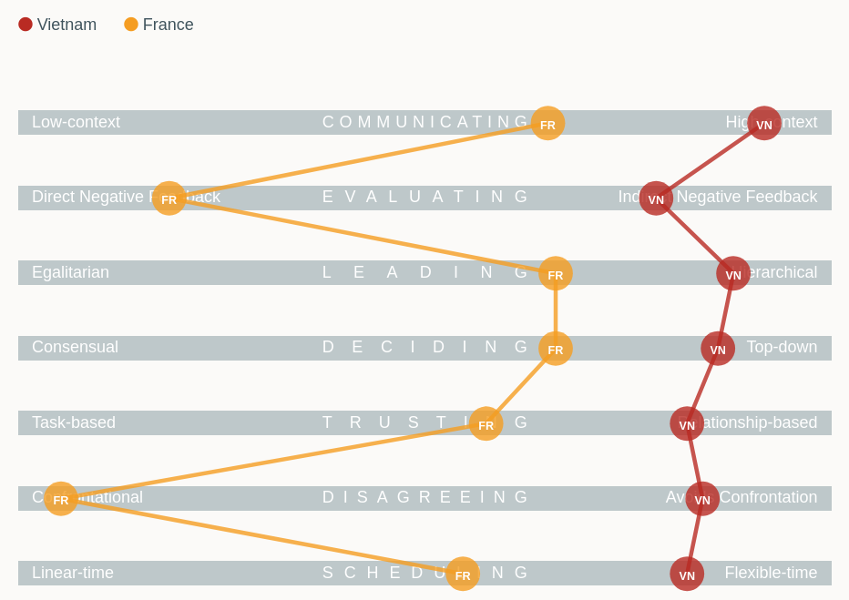

# About this workshop

## Why this workshop?

**TODO:** have An create & perform this slide; also see if An needs an intro slide about himself

::: {.incremental}
- Many local actors collect invaluable data on biodiversity in one of the most biodiversity-rich region in the world
- Much of these data remain unexploited and yet they could benefit both local conservation and the global scientific community
- We believe one reason is that many local actors have limiting quantitative skills
- This workshop aims at strengthening local capacity by training local actors
:::


## The workshop structure

### Module A: background knowledge in view of Module B

- foundation of the R language
- introduction to reproducible reporting workflows
- review of core statistical concepts
- introduction to Linear Models (LMs, GLMs, GLMMs)

. . .

### Module B: actual stuff you want

- single-species occupancy models 
- community-level frameworks
- predicting and mapping occurrence and richness across study across space

# About me, you & us

## The lecturers

:::: {.columns}

::: {.column width="50%"}
\centering
**Module A**: Alexandre Courtiol

```{r}
#| out-height: "5cm"
#| fig-align: center
knitr::include_graphics("figures/Alexandre_Courtiol.jpg", dpi = NA) # dpi = NA fix aspect ratio issue
```
:::

::: {.column width="50%"}
\centering
**Module B**: Rahel Sollmann

```{r}
#| out-height: "5cm"
#| fig-align: center
knitr::include_graphics("figures/Rahel_Sollmann.jpg", dpi = NA) # dpi = NA fix aspect ratio issue
```
:::

::::

## Who am I?

### Quantitative population biologist

::: {.incremental}
- trained in evolution, ecology, demography and statistics
- leader of a small research team tackling diverse questions about the life history and behaviour of mammals and birds ([www.datazoogang.de](https://www.datazoogang.de))
- collaborator in many wildlife projects requiring quantitative skills
- maintainer and co-developers of R packages (e.g. camtrapR, IsoriX...)
- lecturer in data science & statistics
:::
<!-- I shall emphasize after that who I am not: conservationist, data collector-->

## Some examples of the research I contributed to

```{r}
#| layout-ncol: 3
#| fig-align: center
#| out-width: "32%"
article_figs <- dir(path = "figures/article_selection/normalized/",
                    pattern = "article_", full.names = TRUE)
years <- as.integer(sub(".*?(\\d{4})\\.[^.]+$", "\\1", article_figs))
knitr::include_graphics(article_figs[order(years, decreasing = TRUE)])
```

## Who are you?

## Workshop rules

- slides are provided, so invest your time in thinking (not just writing)
- try to learn actively (ask questions)
- treat each others as equal
- there is no dumb question
- avoid using LLMs unless instructed otherwise

## Warning: beware of the culture gap
```{r}
#| out-height: "70%"
#| fig-align: center
#| fig-cap: |
#|   Vietnam vs France across 7 dimensions introduced in The Culture Map book\
#|   data source: [https://erinmeyer.com/tools/culture-map-premium](https://erinmeyer.com/tools/culture-map-premium)

```
\begin{textblock}{2}(12,-4.5)
\includegraphics[width=2cm]{figures/Culture_map_bookcover.jpg}
\end{textblock}

# What next?

## Tentative schedule

| Day   | Date     | Morning                            | Afternoon     |
|-------|----------|------------------------------------|---------------|
| Day 1 | Aug. 24  | Introduction + R language          | R language    |
| Day 2 | Aug. 25  | Reproducible reporting + Practice  | Core concepts |
| Day 3 | Aug. 26  | Core concepts                      | Linear Models |
| Day 4 | Aug. 27  | LMs                                | GLMs, LMMs    |

# Questions?  {.unnumbered .unlisted}
