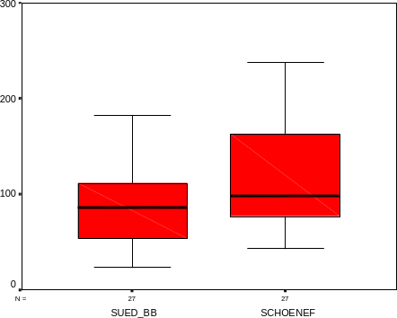
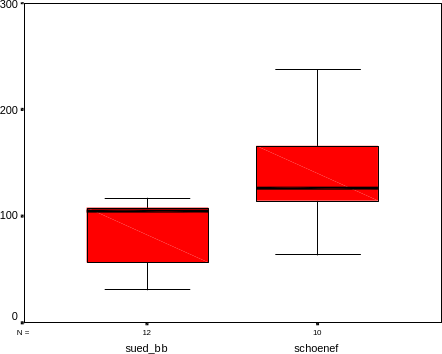

```{r}
#| label: setup
## load packages
start <- Sys.time() # for recording duration
library(tidyverse)
library(geomtextpath)

## set tibble sizes via pillar
options(width = 90, pillar.width = 90,
        pillar.print_min = 3, pillar.print_max = 3)

## set output text size
knitr::opts_chunk$set(size = "footnotesize")
def.chunk.hook <- knitr::knit_hooks$get("chunk")
knitr::knit_hooks$set(chunk = function(x, options) {
  x <- def.chunk.hook(x, options)
  if (!is.null(options$size) && options$size != "normalsize") {
    paste0("\n\\", options$size, "\n\n", x, "\n\n\\normalsize")
  } else {
    x
  }
})

## set base size in ggplot2
theme_set(theme_classic(base_size = 30))

## counter for practice slides, to be called with `r next_practice()`
practice_counter <- 0
next_practice <- function(counter = NULL) {
  if (!is.null(counter)) 
      practice_counter <<- counter
  else
    practice_counter <<- practice_counter + 1
  practice_counter
}
```

# Population and sample

## Population and sample --- what are statistics for?

::::: columns
::: {.column width="70%"}
\begin{itemize}
\item<2-> summarise or describe a \blueit{population} of objects
\item<3-> recognise and describe the effects of something on something else in a \blueit{population} of objects
\item<4-> predict the effects of something on something else in a \blueit{population} of objects
\end{itemize}
\begin{center}
\only<5->{$\rightarrow$ from a limited \blueit{sample}}
\end{center}
:::

::: {.column width="30%"}
\only<1-4>{
\begin{minipage}[t][7cm][t]{\linewidth}
\only<2>{
\begin{figure}
\includegraphics[width=\linewidth]{figures/tigers.png}
\caption{\scriptsize{Haplotype network of tigers\\
(Wilting et al. 2015)}}
\end{figure}
}
\only<3>{
\begin{figure}
\includegraphics[width=\linewidth]{figures/eles_mortality.png}
\caption{\scriptsize{Yearly mortality rates of Myanmar timber elephants\\
(Lahdenperä et al. 2018)}}
\end{figure}
}
\only<4>{
\begin{figure}
\includegraphics[width=\linewidth]{figures/bats_hibernation.png}
\caption{\scriptsize{Potential hibernation area of common noctule bats\\
(Kravchenko et al. 2025)}}
\end{figure}
}
\end{minipage}
}
:::
:::::

\uncover<6->{
\begin{callout}
\bluebold{Goals of statistics}
\begin{itemize}
\item mediates between a \blueit{sample} and the \blueit{population}
\item provides methods to draw as many conclusions as precisely as possible with as little \blueit{sampling effort} as possible
\end{itemize}
\end{callout}
}
\uncover<7>{
Some practical questions we will tackle:\

\emph{How \bluenorm{large} does the sample need to be? How to recognise and describe \bluenorm{relationships} among variables? How to quantify the \bluenorm{reliability} of the conclusions}?
}

## Population and sample --- definitions

\bluebold{An adequate sample}

a statistical sample should adequately \bluenorm{represent} the composition and properties of the entire population

. . .

\vspace{0.5cm}

\bluebold{The population}

this is the level at which you want to \bluenorm{discuss} your results

. . .

$\rightarrow$ depends on the \bluenorm{research question}!

. . .

\vspace{0.5cm}

\textcolor{red}{Is a blood sample an adequate statistical sample?}

\vspace{1em}

::: incremental
\tightlist

- Yes?
- No?
- \bluenorm{It depends!}
:::


## Population and sample --- in practice

\textcolor{red}{Which design would you prefer to study a new drug aiming at preventing stroke?}

\footnotesize from \bluenorm{Ulrich Dirnagl} (Charité, Berlin)\normalsize

::::: columns
::: {.column width="45%"}
```{r}
#| out-height: "4cm"
#| fig-align: center
knitr::include_graphics("figures/twin_studies.png", dpi = NA)
```
:::

::: {.column width="55%"}
\bluebold{DESIGN A}

healthy, pubertal male twins raised in 6 m$^2$ isolator tents on an enriched granola diet

\begin{center}
\textbf{vs.}
\end{center}

\bluebold{DESIGN B}

patients of both sexes, elderly, comorbid, multiple medications, exposed to multiple pathogens and antigens throughout life
:::
:::::

. . .

\begin{callout}
\centering
The right \blueit{sampling design} may increase the external validity of your findings!
\end{callout}

. . .

\textcolor{red}{What would you mostly find in the medical literature?}


## Population and sample --- external validity

```{r}
#| out-height: "3cm"
#| fig-align: center
knitr::include_graphics("figures/twin_studies_title.png", dpi = NA) # dpi = NA fix aspect ratio issue
```

\vspace{0.3cm}

\scriptsize "With few exceptions, stroke research is conducted in healthy, very young, male inbred rodent strains raised under specific pathogen-free conditions and fed a diet optimized for high fertility and overall health. The equivalent human cohort would be healthy pubertal twins raised in 6 m$^2$ isolator tents on an enriched granola diet, but patients with stroke are elderly, of both sexes, comorbid, on multiple medications, and have had exposure to numerous pathogens and antigens throughout their life. \[...\] As a general rule, the closer stroke models have mimicked patients with stroke \[...\], the more substantial has been the loss in efficacy of the treatment effects."

\footnotesize\bluebold{See also} Voelkl, B., Würbel, H., Krzywinski, M. \emph{et al.} The standardization fallacy. \emph{Nat Methods} \textbf{18}, 5--7 (2021). \url{https://doi.org/10.1038/s41592-020-01036-9}\normalsize


## Population and sample --- sampling effort

The \blueit{sampling effort} should:

- maximise the \blueit{sample size}
- minimise the \blueit{dependence} between objects
- (given constraints: time, money, impact...)

. . .

\vspace{0.5cm}

\textcolor{red}{Assuming that you only have a few minutes to sample hair in the classroom in order to estimate the average length of a piece of hair in the population, what should you do?}

1.  sample 10,000 pieces of hair on 2 individuals?
2.  sample 1,000 pieces of hair on 10 individuals?
3.  sample 500 pieces of hair on 4 males & 4 females?

. . .

\vspace{0.5cm}

$\rightarrow$ the best strategy depends on the extent to which hair length depends on sex & on the sex-ratio in \blueit{population}!


## Population and sample --- dependence between objects

\vspace{0.5cm}

\bluebold{Dependence between objects}

interrelationships between objects of the sample may lead to similarities of properties or measurements to be analysed

\vspace{0.5cm}
\bluebold{Usual sources of dependence}

- time $\rightarrow$ generates \blueit{temporal autocorrelation}
- location $\rightarrow$ generates \blueit{spatial autocorrelation}
- measurements on the same individual $\rightarrow$ generates \blueit{pseudoreplication}
- pedigree/ancestry $\rightarrow$ generates \blueit{genetic correlation}


## Population and sample --- dependence between objects

\bluebold{Scenario I} stress hormone concentrations in faeces of \bluenorm{unknown} roe deer, sampled in southern Brandenburg and in the proximity of an airport

::::: columns
::: {.column width="50%"}
{width="95%"}
:::

::: {.column width="50%"}
\vspace{1cm}

Mann-Whitney U-test[^1]:\
p = 0.079; n = 54

difference of means: 26.5

. . .

\vspace{0.3cm}

\bluebold{problem}\
population = faeces $\rightarrow$ \blueit{pseudoreplication!}
:::
:::::

[^1]: \footnotesize a non-parametric alternative to the unpaired t-test which is more robust


## Population and sample --- dependence between objects

\bluebold{Scenario II} stress hormone concentrations in faeces assigned to \bluenorm{known} roe deer individuals, sampled in southern Brandenburg and in the proximity of an airport

::::: columns
::: {.column width="50%"}
{width="95%"}
:::

::: {.column width="50%"}
```{=latex}
\setcounter{footnote}{0}
```

\vspace{1cm}

Mann-Whitney U-test[^2]:\
p = 0.004; n = 22

difference of means: 48.8

. . .

\vspace{0.3cm}

\bluebold{solution}\
population = deer

\begin{callout}
$\rightarrow$ fewer independent data points can contain more information than many dependent ones!
\end{callout}
:::
:::::

[^2]: \footnotesize a non-parametric alternative to the unpaired t-test which is more robust


# Random variables and probability distributions

## Random variables and probability distributions --- definitions

\vspace{0.5cm}

\begin{itemize}
\item<1->{\bluebold{random variable} a variable which can take different values}
\item<2->{\bluebold{estimator} a method for estimating an unknown parameter using the sample-based measurements \\ 
$\rightarrow$ a random variable}
\item<3->{\bluebold{estimate} the estimation of the unknown parameter given by the estimator \\ 
$\rightarrow$ a realization from a random variable}
\end{itemize}

\vspace{1cm}

\uncover<4>{
\begin{callout}
Because they are computed from a sample rather than from the entire population, the estimator is a \blueit{random variable} and its outcome is called the \blueit{estimate}!
\end{callout}
}


## Random variables and probability distributions --- definitions

To describe the outcome of a \blueit{random variable}, we use \blueit{probability distributions}

\bluebold{Probability distributions}

- are compact and comprehensive description of the \blueit{relative frequency} of all possible values
- comprises much more \blueit{information} than single estimator outcome
- are the most important tool of the theory for statistical estimation and \blueit{tests}
- serve as models for real data, which enables the estimation of \blueit{confidence intervals} and statistical \blueit{tests}

::: columns
::: {.column width="33%"}
```{r}
#| echo: false
#| out-height: "2.3cm"
#| fig-align: center
#| fig-cap: \scriptsize normal distribution
ggplot() +
  stat_function(fun = dnorm, n = 100, fill = "#595959",
                xlim = c(-4, 4), geom = "area") +
  labs(y = "Density")
```
:::
::: {.column width="33%"}
```{r}
#| echo: false
#| out-height: "2.3cm"
#| fig-align: center
#| fig-cap: \scriptsize chi-squared distribution
ggplot() +
  stat_function(fun = \(x) dchisq(x, df = 5),
                n = 100, fill = "#595959",
                xlim = c(0, 20), geom = "area") +
  labs(y = "Density")
```
:::
::: {.column width="33%"}
```{r}
#| echo: false
#| out-height: "2.3cm"
#| fig-align: center
#| fig-cap: \scriptsize Poisson distribution
tibble(x = 0:10,
       density = dpois(x, lambda = 2)) |> 
  ggplot() +
    aes(x = x, y = density) +
    geom_col(fill = "#595959") +
    labs(y = "Density")
```
:::
:::


## Random variables and probability distributions --- empirical description

\bluebold{Qualitative data}

- observations ("measurements") described by 2 or more \blueit{categories}
- special case: \blueit{binary} data (2 categories)

$\rightarrow$ can be fully described by a \blueit{contingency table}, i.e. a table providing the number of observation for each category

. . .

\vspace{1em}

::::: columns
::: {.column width="50%"}
\centering\bluebold{tidyverse}

```{r}
#| echo: true
iris |> count(Species)
```
:::

::: {.column width="50%"}
\centering\bluebold{base R}

```{r}
#| echo: true
table(iris$Species)
```
:::
:::::


## Random variables and probability distributions --- empirical description

\bluebold{Qualitative data}

- observations ("measurements") described by 2 or more \blueit{categories}
- special case: \blueit{binary} data (2 categories)

$\rightarrow$ can be fully described by a \blueit{barplot} illustrating the contingency table

\vspace{1em}

::::: columns
::: {.column width="50%"}
```{r}
#| echo: true
#| eval: false
ggplot(iris) +
  aes(x = Species) +
  geom_bar()
```
:::

::: {.column width="50%"}
```{r}
#| echo: false
#| out-height: "3cm"
#| fig-align: center
ggplot(iris) +
  aes(x = Species) +
  geom_bar()
```
:::
:::::


## Random variables and probability distributions --- empirical description

\bluebold{Quantitative data}

- measurements (\blueit{continuous}) and counts (\blueit{discrete})
- distance between each pair of data points is meaningful

$\rightarrow$ can be fully described by an \blueit{empirical cumulative distribution function} (ecdf)

\vspace{1em}

::::: columns
::: {.column width="60%"}
```{r}
#| echo: true
#| eval: false
ggplot(iris) +
  aes(x = Petal.Length) +
  geom_step(stat = "ecdf") +
  geom_point(stat = "ecdf") +
  labs(y = "Cumulative probability",
       x = "Petal length")
```
:::

::: {.column width="40%"}
```{r}
#| echo: false
#| out-height: "3cm"
#| fig-align: center
ggplot(iris) +
  aes(x = Petal.Length) +
  geom_step(stat = "ecdf") +
  geom_point(stat = "ecdf") +
  labs(y = "Cumulative probability",
       x = "Petal length")
```
:::
:::::


## Random variables and probability distributions --- empirical description

\bluebold{Quantiles}

- the ecdf directly provides \blueit{quantiles}, i.e. the values at or below which given \blueit{proportions} of the data fall

::::: columns
::: {.column width="60%"}
```{r}
#| echo: true
quantile(iris$Petal.Length, probs = 0.75)
```
:::

::: {.column width="40%"}
```{r}
#| echo: false
#| out-height: "3cm"
#| fig-align: center
ggplot(iris) +
  aes(x = Petal.Length) +
  geom_step(stat = "ecdf") +
  geom_point(stat = "ecdf") +
  geom_segment(y = 0.75, yend = 0.75,
               x = 0, xend = quantile(iris$Petal.Length, 0.75),
               colour = "#3333B3") +
  geom_segment(y = 0.75, yend = 0,
               x = quantile(iris$Petal.Length, 0.75),
               xend = quantile(iris$Petal.Length, 0.75),
               arrow = grid::arrow(), colour = "#3333B3") +
  scale_x_continuous(breaks = c(2, 4, 5.1, 6)) +
  labs(y = "Cumulative probability",
       x = "Petal length")
```
:::
:::::

**NB:**

- reading up from a given cumulative probability (e.g. \bluenorm{0.75}) to the curve, then across to the x-axis, identifies the corresponding \blueit{quantile} of petal length


## Random variables and probability distributions --- comparing distributions

\bluebold{Quantile–quantile plot}

- the QQ plot compares 2 distributions by plotting their quantiles against each other
- it is often used to compare a distribution derived from the data to a normal distribution with same mean and variance (default in e.g. `geom_qq()`)

::::: columns
::: {.column width="60%"}
```{r}
#| eval: false
#| echo: true
set.seed(123) # randomness is "fixed"
tibble(x = rnorm(n = 50)) |> # normal
ggplot(aes(sample = x)) +
  geom_qq(shape = 1) +
  geom_qq_line()
```
:::

::: {.column width="40%"}
```{r}
#| echo: false
#| out-height: "2.5cm"
#| fig-align: center
set.seed(123)
tibble(x = rnorm(n = 50)) |> 
  ggplot(aes(sample = x)) +
  geom_qq(shape = 1) +
  geom_qq_line()
```
:::
:::::

. . .

- if the points fall \bluenorm{close to the QQ line}, they are \bluenorm{compatible} with expectations under a \blueit{normal distribution}

```{r}
#| eval: false
#| echo: false
#| label: qq plot by hand
set.seed(123)
d <- tibble(x = rchisq(n = 50, df = 4))

ggplot(d) +
  aes(sample = x) +
  geom_qq(shape = 1) +
  geom_qq_line()

## replicate the qqplot (ppoints generates a seq of prob):
d |>
  mutate(prob = ppoints(length(x)),
         theoretical = qnorm(prob)) -> d_qq

Y <- quantile(d_qq$x, probs = c(0.25, 0.75))
X <- qnorm(c(0.25, 0.75))
slope <- diff(Y)/diff(X)
intercept <- Y[1] - slope*X[1]

d_qq |>
  ggplot() +
    aes(x = theoretical, y = sort(x)) +
    geom_point() +
    geom_abline(slope = slope, intercept = intercept)
```

## Random variables and probability distributions --- comparing distributions

\bluebold{Quantile–quantile plot}

- the QQ plot compares 2 distributions by plotting their quantiles against each other
- it is often used to compare a distribution derived from the data to a normal distribution with same mean and variance (default in e.g. `geom_qq()`)

::::: columns
::: {.column width="60%"}
```{r}
#| eval: false
#| echo: true
set.seed(123) # randomness is "fixed"
tibble(x = rchisq(n = 50, df = 2)) |> # chi-squared
ggplot(aes(sample = x)) +
  geom_qq(shape = 1) +
  geom_qq_line()
```
:::

::: {.column width="40%"}
```{r}
#| echo: false
#| out-height: "2.5cm"
#| fig-align: center
set.seed(123)
tibble(x = rchisq(n = 50, df = 2)) |> 
  ggplot(aes(sample = x)) +
  geom_qq(shape = 1) +
  geom_qq_line()
```
:::
:::::

- if the points fall \bluenorm{close to the QQ line}, they are \bluenorm{compatible} with expectations under a \blueit{normal distribution}
- if many of the points fall \bluenorm{far from the QQ line}, they are not \bluenorm{compatible} with expectations under a \blueit{normal distribution} (see next course)


## Random variables and probability distributions --- comparing distributions

\bluebold{Quantitative data}

a \blueit{histogram} does \textcolor{red}{NOT} fully describe a distribution

::::: columns
::: {.column width="60%"}
```{r}
#| eval: false
#| echo: true
ggplot(iris) +
  aes(x = Petal.Length) +
  geom_histogram(colour = "white") +
  geom_rug()
```
:::

::: {.column width="40%"}
```{r}
#| echo: false
#| out-height: "3cm"
#| fig-align: center
ggplot(iris) +
  aes(x = Petal.Length) +
  geom_histogram(colour = "white") +
  geom_rug()
```
:::
:::::


## Random variables and probability distributions --- comparing distributions

\bluebold{Quantitative data}

a \blueit{histogram} does \textcolor{red}{NOT} fully describe a distribution

::::: columns
::: {.column width="60%"}
```{r}
#| eval: false
#| echo: true
ggplot(iris) +
  aes(x = Petal.Length) +
  geom_histogram(colour = "white", binwidth = 0.5) +
  geom_rug()
```
:::

::: {.column width="40%"}
```{r}
#| echo: false
#| out-height: "3cm"
#| fig-align: center
ggplot(iris) +
  aes(x = Petal.Length) +
  geom_histogram(colour = "white", binwidth = 0.5) +
  geom_rug()
```
:::
:::::

**NB:**

- the choice of bin width changes the perceived shape of the distribution\
  $\rightarrow$ there is no single "correct" histogram for a given dataset
- not the best tool to check for normality (use Q-Q plots instead)


## Random variables and probability distributions --- theoretical distributions

```{r}
#| out-height: "7cm"
#| fig-align: center
knitr::include_graphics("figures/distributions.png", dpi = NA) # dpi = NA fix aspect ratio issue
```

\centering \footnotesize from Casella & Berger \emph{Statistical Inference}, 1990\normalsize

## Random variables and probability distributions --- the binomial distribution

\blueit{Probability density function} (aka *pdf*) for a probability of success of 0.2, over 10 trials:

```{r}
#| echo: true
#| results: hide
dbinom(x = 0:10, size = 10, prob = 0.2)
```

::::: columns
::: {.column width="55%"}
```{r}
#| echo: false
#| out-height: "4cm"
#| fig-align: center
library(tidyverse)
tibble(Successes = 0:10,
       Density = dbinom(Successes, size = 10, prob = 0.2)) |> 
  ggplot() + 
    aes(y = Density, x = Successes) + 
    geom_col(width = 0.5) +
    scale_x_continuous(breaks = 0:10) + 
    labs(x = "Successes")
```
:::

::: {.column width="45%"}
\begin{center}
$f(x,n,p) = \Pr(X=x) = \dbinom{n}{x}p^x(1-p)^{n-x}$

\vspace{4pt}
{\footnotesize for $x = 0, 1, 2, \ldots, n$, where}
\vspace{4pt}

$\dbinom{n}{x} = \dfrac{n!}{x!(n-x)!}$
\end{center}
:::
:::::

\onslide*<1>{
The density gives the expected probability for exactly \textbf{\emph{x}} successes in \textbf{\emph{n}} \blueit{independent} binary trials if the probability for one success is equal to \textbf{\emph{p}}
}
\onslide*<2>{
If the probability of catching a bird in one attempt is now expected to be 5\%. Then, \textcolor{red}{what is the chance that the biologist will capture exactly one bird in 10 attempts?}
}


## Random variables and probability distributions --- the binomial distribution

\blueit{Density} for exactly one \blueit{success}, for a probability of success of 0.05 over 10 trials:

```{r}
#| echo: true
#| results: hide
dbinom(x = 1, size = 10, prob = 0.05)
```

::::: columns
::: {.column width="55%"}
```{r}
#| echo: false
#| out-height: "4cm"
#| fig-align: center
library(tidyverse)
tibble(Successes = 0:10,
       Density = dbinom(Successes, size = 10, prob = 0.05),
       Select = Successes == 1) |> 
  ggplot() + 
    aes(y = Density, x = Successes, fill = Select) + 
    geom_col(width = 0.5) +
    scale_x_continuous(breaks = 0:10) + 
    scale_fill_manual(values = c("#595959", "#3333B3"), guide = "none") +
    labs(x = "Successes")
```
:::

::: {.column width="45%"}
\begin{center}
$f(x,n,p) = \Pr(X=x) = \dbinom{n}{x}p^x(1-p)^{n-x}$

\vspace{4pt}
{\footnotesize for $x = 0, 1, 2, \ldots, n$, where}
\vspace{4pt}

$\dbinom{n}{x} = \dfrac{n!}{x!(n-x)!}$
\end{center}
:::
:::::

\onslide*<1>{
If the probability of catching a bird in one attempt is now expected to be 5\%. Then, \textcolor{red}{what is the chance that the biologist will capture exactly one bird in 10 attempts?}
}


## Random variables and probability distributions --- the binomial distribution

\blueit{Cumulative distribution function} (*cdf*) for a probability of success of 0.2 over 10 trials:

```{r}
#| echo: true
#| results: hide
pbinom(q = 0:10, size = 10, prob = 0.2)
```

::::: columns
::: {.column width="55%"}
```{r}
#| echo: false
#| out-height: "4cm"
#| fig-align: center
d <- tibble(Successes = c(0, 0:10),
            Cumulative_prob = c(0, pbinom(q = 0:10, size = 10, prob =  0.2)))
ggplot(d) + 
  aes(y = Cumulative_prob, x = Successes) + 
  geom_step(linewidth = 1) +
  geom_point(data = d[-1, ]) +
  scale_x_continuous(breaks = 0:10) +
  scale_y_continuous(limits = c(0, 1)) +
  labs(y = "Cumulative probability", x = "Successes")
```
:::

::: {.column width="45%"}
\begin{center}
$F(x,n,p) = \Pr(X \le x) = \displaystyle\sum_{i=0}^{\lfloor x \rfloor} \dbinom{n}{i}p^i(1-p)^{n-i}$

\vspace{4pt}
{\footnotesize where $\dbinom{n}{i} = \dfrac{n!}{i!(n-i)!}$}
\end{center}
:::
:::::

\onslide*<1>{
The cumulative probability gives the expected probability for \textbf{\emph{x}} or fewer successes in \textbf{\emph{n}} \blueit{independent} binary trials if the probability for one success is equal to \textbf{\emph{p}}
}
\onslide*<2>{
If the probability of catching a bird in one attempt is expected to be 5\%. Then,\\
\textcolor{red}{what is the chance that the biologist will capture at least two birds in 10 attempts?}
}


## Random variables and probability distributions --- the binomial distribution

Probability of at least 2 successes for a probability of success of 0.05 over 10 trials:

```{r}
#| echo: true
#| results: hide
1 - pbinom(q = 1, size = 10, prob = 0.05)
```

::::: columns
::: {.column width="55%"}
```{r}
#| echo: false
#| out-height: "4cm"
#| fig-align: center
tibble(Successes = 0:10,
       Prob = 1 - pbinom(q = Successes - 1, size = 10, prob = 0.05, lower.tail = TRUE),
       Select = Successes == 2) |> 
  ggplot() + 
    aes(y = Prob, x = Successes) + 
    geom_step(linewidth = 1) +
    geom_point(aes(colour = Select)) +
    scale_x_continuous(breaks = 0:10) +
    scale_y_continuous(limits = c(0, 1)) +
    scale_colour_manual(values = c("black", "#3333B3"), guide = "none") +
    labs(y = "Prob. of at least x successes", x = "Successes")
```
:::

::: {.column width="45%"}
\begin{center}
$F(x,n,p) = \Pr(X \le x) = \displaystyle\sum_{i=0}^{\lfloor x \rfloor} \dbinom{n}{i}p^i(1-p)^{n-i}$

\vspace{4pt}
{\footnotesize where $\dbinom{n}{i} = \dfrac{n!}{i!(n-i)!}$}
\end{center}
:::
:::::

\onslide*<1>{
If the probability of catching a bird in one attempt is expected to be 5\%. Then,\\
\textcolor{red}{what is the chance that the biologist will capture at least two birds in 10 attempts?}
}


## Random variables and probability distributions --- the normal distribution

\blueit{Probability density function} for a mean of 0 and a standard deviation of 1

```{r}
#| echo: true
#| results: hide
dnorm(x = seq(-4, 4, length.out = 100))
```

::: columns
::: {.column width="60%"}
```{r}
#| echo: false
#| out-height: "4cm"
#| fig-align: center
ggplot() +
  geom_function(fun = dnorm, n = 100,
                xlim = c(-4, 4), size = 1) +
  labs(y = "Density")
```
:::
::: {.column width="40%"}
\vspace{0.5cm}

standard normal distribution

\begin{center}
$f(x) = \dfrac{1}{\sqrt{2\pi}}\, e^{-x^2/2}$
\end{center}

\vspace{1cm}

general normal distribution

\begin{center}
$f(x,\mu,\sigma) = \dfrac{1}{\sigma\sqrt{2\pi}}\, e^{-\frac{(x-\mu)^2}{2\sigma^2}}$
\end{center}
:::
:::

**NB:** it can be parametrised with mean ($\mu$) and either the SD ($\sigma$) or the variance ($\sigma^2$), with $\hat{\sigma^2} = \frac{1}{n - 1} \sum_{i=1}^n \left(x_i - \hat{\mu}\right)^2$ (note that the " $\hat{}$ " refers to estimates from data, as opposed to population values)


## Random variables and probability distributions --- the normal distribution

\bluebold{From general to standard}: the \blueit{z-scores} transformation

if $X \sim \mathcal{N}(\mu, \sigma)$, then

$z = \frac{x-\hat{\mu}}{\hat{\sigma}} \sim \mathcal{N}(0, 1)$

. . .

Back to general: \bluebold{back transformation}

if $Z \sim \mathcal{N}(0, 1)$, then given $\hat{\mu}$ and $\hat{\sigma}$, we can revert the z-scores transformation:

$x = (z \times \hat{\sigma}) + \hat{\mu}$

. . .

- the z-scores transformation is often used within statistical tests
- it can also help to understand how extreme some measurements are when units are not familiar (e.g. $z = 3$ correspond to a value 3 SD above the mean)
- outliers are often identified as observations with absolute z-scores \> 3 or 4, but very large outliers can inflate $\hat{\sigma}$ and thus be masked; in any case \bluenorm{do not ditch outliers without discussing it!}

## Random variables and probability distributions --- the normal distribution

\blueit{Cumulative distribution function} for a mean of 0 and a standard deviation of 1\
(i.e. the standard normal distribution)

::::: columns
::: {.column width="60%"}
```{r}
#| echo: true
#| results: hide
 pnorm(q = seq(-4, 4, length.out = 100))
```

```{r}
#| echo: false
#| out-height: "4cm"
#| fig-align: center
tibble(x = seq(-4, 4, length.out = 1000),
       Cumulative_prob = pnorm(x)) |> 
  ggplot() +
    aes(x = x, y = Cumulative_prob) + 
    geom_line(size = 1) +
    labs(y = "Cumulative probability")
```
:::

::: {.column width="40%"}
standard normal distribution

\begin{center}
$F(x) = \Pr(X \le x) = \displaystyle\int_{-\infty}^{x} \dfrac{1}{\sqrt{2\pi}}\, e^{-t^2/2}\, dt$
\end{center}

\vspace{1cm}

general normal distribution

\begin{center}
$F(x,\mu,\sigma) = \Pr(X \le x) = \displaystyle\int_{-\infty}^{x} \dfrac{1}{\sigma\sqrt{2\pi}}\, e^{-\frac{(t-\mu)^2}{2\sigma^2}}\, dt$
\end{center}
:::
:::::


## Random variables and probability distributions --- the normal distribution

\textcolor{red}{What is the expected probability that an outcome \emph{x} will be between -1.96 and +1.96 if this event is the result of a standard normal distribution?}

\vspace{1em}

::::: columns
::: {.column width="50%"}
```{r}
#| echo: false
#| out-height: "4cm"
#| fig-align: center
tibble(x = seq(-4, 4, length.out = 1000),
       Density = dnorm(x),
       Density_focus = if_else(abs(x) < qnorm(0.975), Density, 0)) |> 
  ggplot() +
    aes(x = x, y = Density) +
    geom_area(aes(y = Density_focus), fill = "grey") + 
    geom_segment(y = 0, yend = 0, x = -4, xend = 4,
                 linewidth = 2,
                 colour = "#F8766D") +
    geom_segment(y = 0, yend = 0, x = qnorm(0.025), xend = qnorm(0.975),
                 linewidth = 2,
                 colour = "#00BFC4") +
    scale_x_continuous(breaks = c(-4, -1.96, 0, 1.96, 4)) +
    geom_line(size = 1) +
    geom_vline(xintercept = qnorm(0.025), linetype = "dashed", size = 1) +
    geom_vline(xintercept = qnorm(0.975), linetype = "dashed", size = 1) +
    labs(y = "Density")
```
:::

. . .

::: {.column width="50%"}
```{r}
#| echo: false
#| out-height: "4cm"
#| fig-align: center
tibble(q = seq(-4, 4, length.out = 1000),
       Cumulative_Density = pnorm(q),
       Cumulative_Density_focus = if_else(abs(q) < qnorm(0.975), Cumulative_Density, 0)) |>
  ggplot() +
    aes(x = q, y = Cumulative_Density) +
    geom_area(aes(y = Cumulative_Density_focus), fill = "grey") + 
    scale_x_continuous(breaks = c(-4, -1.96, 0, 1.96, 4), limits = c(-5, 4)) +
    geom_line(size = 1) +
    geom_segment(y = 0.025, yend = 0.025,
                 xend = -5.4, x = qnorm(0.025),
                 arrow = grid::arrow(),
                 linewidth = 1) +
    geom_segment(y = 0.975, yend = 0.975,
                 xend = -5.4, x = qnorm(0.975),
                 arrow = grid::arrow(),
                 linewidth = 1) +
    geom_segment(y = 0.025, yend = 0.975,
                 x = -4.5, xend = -4.5, arrow = grid::arrow(ends = "both")) +
    annotate("text", x = -4, y = 0.5, label = "95%",
             hjust = 0, size = 9) +
    annotate("text", x = -4.2, y = 0.025, label = "pnorm(q = -1.96)",
             hjust = 0, vjust = -0.6, size = 7) +
    annotate("text", x = -4.2, y = 0.975, label = "pnorm(q = 1.96)",
             hjust = 0, vjust = -0.6, size = 7) +
    labs(y = "Cumulative probability", x = "x")
```
:::
:::::

## Random variables and probability distributions --- the normal distribution

\textcolor{red}{What is the probability for an observation following a normal distribution to have a value more extreme than:}

- \textcolor{red}{one SD?}
- \textcolor{red}{two SD?}
- \textcolor{red}{three SD?}

\bluebold{Instructions}

- fix the mean to 0 and the SD to 1 to do the computation
- then, try doing the same with a different mean and SD


## Random variables and probability distributions --- the normal distribution

\bluebold{Reverted situation}

\textcolor{red}{If random numbers are drawn from a standard normal distribution, where will the 75\% of central observations fall?}

$\rightarrow$ the answer is given by the \blueit{quantile function}

```{r}
#| echo: false
#| out-height: "4cm"
#| fig-align: center
tibble(q = seq(-4, 4, length.out = 1000),
       Cumulative_Density = pnorm(q),
       Cumulative_Density_focus = if_else(abs(q) < qnorm(0.875), Cumulative_Density, 0)) |>
  ggplot() +
    aes(x = q, y = Cumulative_Density) +
    geom_area(aes(y = Cumulative_Density_focus), fill = "grey") + 
    scale_x_continuous(breaks = c(-4, -1.15, 0, 1.15, 4), limits = c(-5, 4)) +
    geom_line(size = 1) +
    geom_segment(y = 0.125, yend = 0.125,
                 x = -10, xend = qnorm(0.125),
                 linetype = "dashed", size = 1) +
    geom_segment(y = 0.875, yend = 0.875,
                 x = -10, xend = qnorm(0.875),
                 linetype = "dashed", size = 1) +
    geom_segment(y = 0.125, yend = 0.875,
                 x = -4.5, xend = -4.5, arrow = grid::arrow(ends = "both")) +
    geom_segment(y = 0.875, yend = 0,
                 x = qnorm(0.875), xend = qnorm(0.875),
                 arrow = grid::arrow(), linewidth = 0.6) +
    geom_segment(y = 0.125, yend = 0,
                 x = qnorm(0.125), xend = qnorm(0.125),
                 arrow = grid::arrow(), linewidth = 0.6) +
    annotate("text", x = -4, y = 0.5, label = "75%",
             hjust = 0, size = 9) +
    annotate("text", x = -1.2, y = 0.075,
             label = "qnorm(p = 0.125)", hjust = 1, size = 7) +
    annotate("text", x = 1.2, y = 0.075,
             label = "qnorm(p = 0.875)", hjust = 0, size = 7) +
    labs(y = "Cumulative probability", x = "x")
```


## Random variables and probability distributions --- summary

:::::: columns
::: {.column width="31%"}
\centering `dnorm(x = ...)`

```{r}
#| echo: false
#| out-height: "3cm"
#| fig-align: center
#| fig-cap: Probability density function
tibble(x = seq(-4, 4, length.out = 1000),
       Density = dnorm(x)) |> 
  ggplot() +
    aes(x = x, y = Density) + 
    geom_line(size = 1) +
    geom_segment(y = 0, yend = dnorm(-1), x = -1, xend = -1,
                 linewidth = 2, colour = "#3333B3") +
    geom_segment(y = dnorm(-1), yend = dnorm(-1), x = -1, xend = -4.3,
                 arrow = grid::arrow(), linewidth = 2, colour = "#3333B3")
```
:::

::: {.column width="38%"}
\centering `pnorm(q = ...)`

```{r}
#| echo: false
#| out-height: "3cm"
#| fig-align: center
#| fig-cap: \phantom{p} Cumulative distribution function  \phantom{p}
tibble(x = seq(-4, 4, length.out = 1000),
       Cumulative_prob = pnorm(x)) |> 
  ggplot() +
    aes(x = x, y = Cumulative_prob) + 
    geom_line(size = 1) +
    geom_segment(y = 0, yend = pnorm(1), x = 1, xend = 1,
                 linewidth = 2, colour = "#3333B3") +
    geom_segment(y = pnorm(1), yend = pnorm(1), x = 1, xend = -4.3,
                 arrow = grid::arrow(), linewidth = 2, colour = "#3333B3") +
    labs(y = "Cumulative probability")
```
:::

::: {.column width="31%"}
\centering `qnorm(p = ...)`

```{r}
#| echo: false
#| out-height: "3cm"
#| fig-align: center
#| fig-cap: \phantom{p} Quantile function \phantom{p}
tibble(x = seq(-4, 4, length.out = 1000),
       Cumulative_prob = pnorm(x)) |> 
  ggplot() +
    aes(x = x, y = Cumulative_prob) + 
    geom_line(size = 1) +
    geom_segment(y = 0.75, yend = 0.75, x = -4.3, xend = qnorm(0.75),
                 linewidth = 2, colour = "#3333B3") +
    geom_segment(y = 0.75, yend = 0, x = qnorm(0.75), xend = qnorm(0.75),
                 linewidth = 2, colour = "#3333B3",
                 arrow = grid::arrow()) +
    labs(y = "Cumulative probability")
```
:::
::::::

. . .

**NB:**

\vspace{-0.2cm}

- for the general normal distribution one needs to also define `mean = ...` and `sd = ...` in the function calls
- the same logic applies for all distributions (e.g. `dchisq(x = ..., df = ...)`, `pchisq(q = ..., df = ...)`, `qchisq(p = ..., df = ...)`)


# Measuring uncertainty

## Measuring uncertainty --- estimation methods

\vspace{1cm}

\begin{callout}
\textcolor{red}{\textbf{NB:} The distribution of the data is not the distribution of the estimator!}

\footnotesize (even if one can be deduced from the other in some situations)\normalsize
\end{callout}

\vspace{1cm}

\bluebold{Estimation} of uncertainty can be done:

- by assuming a distribution for the estimator
- by simulation (bootstrapping methods)


## Measuring uncertainty --- the central limit theorem

\bluebold{Central limit theorem}

the mean of a sufficiently large number of \blueit{independently and identically distributed} random variables, each with finite mean and variance, will be approximately normally distributed

$\rightarrow$ we can assume that the estimator of the mean follows a \blueit{normal distribution}


## Measuring uncertainty --- the central limit theorem

```{r}
#| out-height: "4cm"
#| fig-align: center
#| fig-cap: |
#|   \textbf{Galton's box / quincunx / bean machine}\
#|   Galton F (1889) \emph{Natural inheritance}. Macmillan, London
knitr::include_graphics("figures/bean_machine.png", dpi = NA) # dpi = NA fix aspect ratio issue
```

\footnotesize \textbf{NB:} \bluenorm{Francis Galton} (1822--1911) was \bluenorm{Charles Darwin}'s half-cousin (same grandfather: Erasmus Darwin). He invented correlations, regressions, dog whistles but also "eugenics". He coined "nature vs nurture". He also discovered anticyclones and was an explorer (e.g. Namibia).\normalsize


## Measuring uncertainty --- metrics

\bluebold{Most widely used metrics}
\begin{itemize}
\item{the standard deviation of the estimator = the \blueit{standard error} (SE)}
\end{itemize}

Example, the \blueit{standard error of the mean} (SEM):

\begin{center}
\begin{minipage}[c]{0.3\textwidth}
\begin{callout}
\centering $$\text{SEM} = \dfrac{\text{SD}(\text{sample})}{\sqrt{n}}$$
\end{callout}
\end{minipage}
\end{center}

\textbf{NB:}

- SD quantifies how much measurements vary between each other
- SE quantifies how precise the estimation of a parameter is\
(i.e. how precise the estimation of the mean is if SE is a SEM)
- SEM varies with $n$ (SD does not)


## Measuring uncertainty --- metrics

\bluebold{Most widely used metrics}
\begin{itemize}
\item{the standard deviation of the estimator = the \blueit{standard error} (SE)}
\item{the 95\% \blueit{confidence interval} (\ci)\\
$\rightarrow$ by definition, the procedure used for constructing the interval has to deliver a CI that includes the true value of the parameter in 95\% of the time}
\end{itemize}

Example: the \blueit{95\% confidence interval for the mean}

\begin{center}
\begin{minipage}[c]{0.8\textwidth}
\begin{callout}
\bluebold{\ci\ for the mean}\\
= mean ± qt(0.975, df)$\times$SEM\\
(df = degrees of freedom = the number of independent pieces of information available for the estimation = $n-1$ if one mean estimated)\\
$\sim$ mean ± qnorm(0.975)$\times$SEM if $n$ is large or SD(pop) known\\
\bluenorm{$\sim$ mean ± 2$\times$SEM}
\end{callout}
\end{minipage}
\end{center}

```{=html}
<!~~ 
could include practice here to check when we cross 2 (between df = 60 and 61)
curve(qt(0.975, df = x), type = "b", from = 55, to = 65, n = 11, log = "y")
abline(h = 2, lty = 2)
~~>
```

## Measuring uncertainty --- metrics

\bluebold{Most widely used metrics}
\begin{itemize}
\item{the standard deviation of the estimator = the \blueit{standard error} (SE)}
\item{the 95\% \blueit{confidence interval} (\ci)\\
$\rightarrow$ by definition, the procedure used for constructing the interval has to deliver a CI that includes the true value of the parameter in 95\% of the time}
\end{itemize}

Example: the \blueit{95\% confidence interval for the mean}

```{r}
#| echo: false
#| out-height: "3cm"
#| fig-align: center
knitr::include_graphics("figures/CI.png", dpi = NA)
```


# Likelihood

## Likelihood --- likelihood vs sampling distribution

\bluebold{Likelihood}

the likelihood of a model given the data is equal to the \blueit{probability density} of those data given assumed parameter
values and distribution of the data: $\mathcal{L}(\theta \mid y) = P(y \mid \theta)$

\vspace{0.5cm}

\begin{callout}
\begin{itemize}
\item the \blueit{sampling distribution} of the estimator shows how much estimates would vary if different samples were collected from the same population
\item the \blueit{likelihood function} instead defines how plausible different estimates are given the sample you have
\end{itemize}
\end{callout}


## Likelihood --- likelihood computation

\bluebold{Likelihood}

the likelihood of a model given the data is equal to the \blueit{probability density} of those data given assumed parameter
values and distribution of the data: $\mathcal{L}(\theta \mid y) = P(y \mid \theta)$

```{r}
#| echo: true
iris |>
  filter(Species == "versicolor") |> 
  mutate(density = dnorm(x = Petal.Length, mean = 4.5, sd = 0.5),
         log_density = dnorm(x = Petal.Length, mean = 4.5, sd = 0.5, log = TRUE)) |> 
  summarise(Lik = prod(density),
            logLik = sum(log_density))
``` 

**NB:**

- using the log-likelihood produces values that are easier to work with, and avoids numerical \blueit{underflow} to zero (which the raw likelihood is prone to)


## Likelihood --- likelihood computation

\bluebold{Likelihood}

the likelihood of a model given the data is equal to the \blueit{probability density} of those data given assumed parameter
values and distribution of the data: $\mathcal{L}(\theta \mid y) = P(y \mid \theta)$

\vspace{0.5cm}

::: columns
::: {.column width="33%"}
```{r}
#| echo: false
#| out-height: "3.5cm"
#| fig-align: center
#| fig-cap: \footnotesize $\mu = 4$, $\sigma = 0.7$
iris |>
    filter(Species == "versicolor") -> iris2

plot_logLik <- function(mu, sigma) {
    tibble(x = seq(2, 6, length = 100),
           y = dnorm(x, mean = mu, sd = sigma)) |> 
        ggplot() +
        aes(y = y, x = x) +
        geom_line() +
        geom_segment(aes(x = Petal.Length,
                         xend = Petal.Length,
                         y = 0,
                         yend = density),
                     data = iris2 |>
                         mutate(density = dnorm(Petal.Length,
                                                mean = mu, sd = sigma)),
                     colour = "#3333B3", linewidth = 0.3) +
        geom_segment(aes(xend = 2,
                         x = Petal.Length,
                         y = density,
                         yend = density),
                     data = iris2 |>
                         mutate(density = dnorm(Petal.Length,
                                                mean = mu, sd = sigma)),
                     colour = "#3333B3",
                     arrow = grid::arrow(length = unit(7, "pt")),
                     linewidth = 0.3) +
        geom_point(aes(x = Petal.Length), y = 0,
                   data = iris2, shape = 21) +
        labs(y = "Density", x = "Petal Length (cm)") +
        annotate("text", y = 0.8, x = 4.7, hjust = 0,
                 label = paste("logLik =", round(sum(dnorm(iris2$Petal.Length,
                                                           mean = mu, sd = sigma, log = TRUE)), digit = 1))) +
        coord_cartesian(ylim = c(0, 0.8))
}

plot_logLik(4, 0.7)
```
:::

. . .

::: {.column width="33%"}
```{r}
#| echo: false
#| out-height: "3.5cm"
#| fig-align: center
#| fig-cap: \footnotesize $\mu = 4.5$, $\sigma = 0.7$
plot_logLik(4.5, 0.7)
```
:::

. . .

::: {.column width="33%"}
```{r}
#| echo: false
#| out-height: "3.5cm"
#| fig-align: center
#| fig-cap: \footnotesize $\mu = 4.5$, $\sigma = 0.5$
plot_logLik(4.5, 0.5)
```
:::
:::


## Likelihood --- maximum likelihood estimates

\bluebold{Maximum likelihood estimates (MLE)}

MLE are estimates that maximise the likelihood function 

::: columns
::: {.column width="50%"}
```{r}
#| echo: false
#| out-height: "3cm"
#| fig-align: center
#| fig-cap: \footnotesize log-\blueit{likelihood profile} for $\mu$
#| label: logLikprof

# I use known ML estimates and CI from spaMM to avoid having to compute them numerically
ML <- sum(dnorm(iris2$Petal.Length,
                mean = mean(iris2$Petal.Length),
                sd = sd(iris2$Petal.Length)*sqrt((nrow(iris2) - 1)/nrow(iris2)),
                log = TRUE))
y_CI <- ML - qchisq(0.95, df = 1)/2
x_CI <- confint(spaMM::fitme(Petal.Length ~ 1, data = iris2),
                parm = "(Intercept)", verbose = FALSE)$interval

tibble(mu = seq(4, 4.5, length = 100),
       logLik = sapply(mu, \(m) {
    optimise(\(sd) sum(dnorm(x = iris2$Petal.Length, mean = m, sd = sd, log = TRUE)), interval = c(0.35, 0.7), maximum = TRUE)$objective
    })) |> 
    ggplot() +
      aes(y = logLik, x = mu) +
      geom_line() +
      geom_segment(y = ML,
               yend = -100,
               x = mean(iris2$Petal.Length),
               xend = mean(iris2$Petal.Length),
               linetype = "dashed",
               colour = "#3333B3") +
      geom_segment(y = ML, yend = ML, xend = 4, x = mean(iris2$Petal.Length),
                   colour = "red", linetype = "dotted") +
      labs(x = expression(mu)) +
      scale_y_continuous(breaks = c(-40:-30, round(ML, digits = 2)))
```
:::
::: {.column width="50%"}
```{r}
#| echo: false
#| out-height: "3cm"
#| fig-align: center
#| fig-cap: \footnotesize joint log-\blueit{likelihood surface} for $\mu$ & $\sigma$
#| label: maxlogLik
expand.grid(mu = seq(4, 4.5, length = 40),
            sd = seq(0.35, 0.6, length = 40)) |> 
    rowwise() |> 
    mutate(logLik = sum(dnorm(x = iris2$Petal.Length, mean = mu, sd = sd, log = TRUE))) |> 
    ungroup() |> 
    ggplot() +
      aes(z = logLik, x = mu, y = sd) +
      geom_textcontour(breaks = c(-40:-34, -33.5, -33, -32.8)) +
    geom_point(y = sd(iris2$Petal.Length)*sqrt((nrow(iris2) - 1)/nrow(iris2)),
               x = mean(iris2$Petal.Length), colour = "red",
               shape = "+", size = 5) +
    labs(y = expression(sigma), x = expression(mu))
```
:::
:::

. . .

- in this simple case the MLE of $\mu$ is the mean and the MLE of $\sigma$ is the SD computed with an n-denominator rather than n−1, i.e. $\sqrt{\frac{1}{n} \sum_{i=1}^n \left(x_i - \hat{\mu}\right)^2}$, or\
in R, `sd(x)*sqrt((n-1)/n)`


## Likelihood --- maximum likelihood estimates

\bluebold{Maximum likelihood estimates (MLE)}

MLE are estimates that maximise the likelihood function 

::: columns
::: {.column width="50%"}
```{r}
#| echo: false
#| out-height: "3cm"
#| fig-align: center
#| fig-cap: \footnotesize log-\blueit{likelihood profile} for $\mu$
#| label: logLikprof_with_CI

# I use known ML estimates and CI from spaMM to avoid having to compute them numerically
y_CI <- ML - qchisq(0.95, df = 1)/2
x_CI <- confint(spaMM::fitme(Petal.Length ~ 1, data = iris2),
                parm = "(Intercept)", verbose = FALSE)$interval

tibble(mu = seq(4, 4.5, length = 100),
       logLik = sapply(mu, \(m) {
    optimise(\(sd) sum(dnorm(x = iris2$Petal.Length, mean = m, sd = sd, log = TRUE)), interval = c(0.35, 0.7), maximum = TRUE)$objective
    })) |> 
    ggplot() +
      aes(y = logLik, x = mu) +
      geom_line() +
      geom_segment(y = ML,
               yend = -100,
               x = mean(iris2$Petal.Length),
               xend = mean(iris2$Petal.Length),
               linetype = "dashed",
               colour = "#3333B3") +
      geom_segment(y = y_CI, yend = y_CI, xend = 4, x = x_CI[2],
                   colour = "red", linetype = "dotted") +
      geom_segment(y = ML, yend = ML, xend = 4, x = mean(iris2$Petal.Length),
                   colour = "red", linetype = "dotted") +
      geom_segment(x = x_CI[1], xend = x_CI[1], y = y_CI, yend = -100,
                   linetype = "dashed", colour = "#3333B3", linewidth = 0.5) +
      geom_segment(x = x_CI[2], xend = x_CI[2], y = y_CI, yend = -100,
                   linetype = "dashed", colour = "#3333B3", linewidth = 0.5) +
      geom_segment(x = 4.02, xend = 4.02, y = ML, yend = y_CI, arrow = grid::arrow()) +
      annotate("text", y = (0.9*ML + 0.1*y_CI), x = 4.025, hjust = 0, label = "max - qchisq(0.95, df = 1)/2", size = 5) +
      labs(x = expression(mu)) +
      scale_y_continuous(breaks = c(-40:-30, round(y_CI, digits = 2), round(ML, digits = 2)))
```
:::
::: {.column width="50%"}
```{r}
#| echo: false
#| out-height: "3cm"
#| fig-align: center
#| fig-cap: \footnotesize joint log-\blueit{likelihood surface} for $\mu$ & $\sigma$
#| label: maxlogLik_bis
expand.grid(mu = seq(4, 4.5, length = 40),
            sd = seq(0.35, 0.6, length = 40)) |> 
    rowwise() |> 
    mutate(logLik = sum(dnorm(x = iris2$Petal.Length, mean = mu, sd = sd, log = TRUE))) |> 
    ungroup() |> 
    ggplot() +
      aes(z = logLik, x = mu, y = sd) +
      geom_textcontour(breaks = c(-40:-34, -33.5, -33, -32.8)) +
    geom_point(y = sqrt(sd(iris2$Petal.Length)^2*(nrow(iris2) - 1)/nrow(iris2)),
               x = mean(iris2$Petal.Length), colour = "red",
               shape = "+", size = 5) +
    labs(y = expression(sigma), x = expression(mu))
```
:::
:::

- \ci\ can also be derived from this approach


# Tests and p-values

## Tests and p-values --- principles

\vspace{1cm}

\bluebold{Test setup}

1.  formulate a null hypothesis $H_0$ for a population:\
    $\rightarrow$ $H_0$ is chosen in contrast to the experimental hypothesis ($H_1$)
2.  select and measure a sample
3.  question: is the sample compatible with $H_0$?
    - if "YES": by chance or reliably so?
    - if "NO": by chance or reliably so?


## Tests and p-values --- the null hypothesis

\vspace{1cm}

Ronald Fisher, \emph{The Design of Experiments}, Edinburgh: Oliver and Boyd, 1935, p. 18

\vspace{0.5cm}

\begin{quote}
"\emph{In relation to any experiment we may speak of this hypothesis as the \bluenorm{null hypothesis}, and it should be noted that the null hypothesis is never proved or established, but is possibly disproved, in the course of experimentation.}

\vspace{1cm}

\emph{Every experiment may be said to exist only in order to give the facts a chance of disproving the null hypothesis.}"
\end{quote}

## Tests and p-values --- "testing by eye" using \ci

- comparison of one estimated parameter $\hat{\mu}$ (e.g. a mean) with a fixed value $\mu_0$\
  (\bluenorm{$H_0$: $\hat{\mu} = \mu_0$})

  - if $\mu_0$ is located outside the \ci, then $\hat{\mu}$ differs significantly from $\mu_0$\
    (given $\alpha$ = 5%; more on $\alpha$ later)

. . .

\vspace{0.5cm}

- comparison of two estimated parameters $\hat{\mu}_1$ & $\hat{\mu}_2$ (e.g. two means)\
  (\bluenorm{$H_0$: $\hat{\mu}_1 = \hat{\mu}_2$})

  a.  if the two \ci\ do not overlap, then their means are significantly different
  b.  if the two \ci\ overlap, then, mostly, the difference between the means is not significant; however, it may happen that, for small overlaps, the difference is significant $\rightarrow$ the \ci\ for the difference between two means $\neq$ the difference between two individual\ci\


## Tests and p-values --- "testing by eye" using \ci

\begin{center}
\includegraphics[height=0.8\textheight]{figures/errorbars_paper.jpg}
\end{center}

\footnotesize Cumming et al. (2007) Error bars in experimental biology. \emph{Journal of Cell Biology} 177(1): 7--11\normalsize

## Principles of statistical tests --- test statistics

1.  formulate a null hypothesis $H_0$
2.  define a \bluenorm{test statistic}, a function $f$ suited to quantify the null hypothesis (e.g. difference of height means)
3.  select a sample
4.  hypothesise a distribution of $f$ under $H_0$; e.g. $f$ is assumed to be normally distributed (bell-shaped)
5.  according to $H_0$, mean($f$) = 0; SD($f$) is derived from the selected sample
6.  calculate the value $v$ = $f$(sample) for the sample

. . .

::::: columns
::: {.column width="55%"}
\begin{callout}
Where is $v$ located in the test distribution?
\begin{itemize}
\item $v$ near the edge: \bluebold{reject} $H_0$
\item $v$ near the middle: \bluebold{do not reject} $H_0$
\end{itemize}

\end{callout}
:::

::: {.column width="45%"}
```{r}
#| echo: false
#| out-height: "3cm"
#| fig-align: center
tibble(x = seq(-4, 4, length.out = 1000),
       Density_full = dnorm(x),
       Density = ifelse(x > 1, dnorm(x), 0)) |> 
  ggplot() +
    geom_area(aes(x = x, y = Density), fill = "grey") +
    geom_line(aes(x = x, y = Density_full), linewidth = 1) +
    geom_segment(x = 1, xend = 1, y = -0.02, yend =  dnorm(1),
                 linetype = "dashed", colour = "#3333B3") +
    annotate("text", y = 0.35, x = 1.5, label = "H0") +
    annotate("text", y = -0.04, x = 1, label = "v", colour = "#3333B3",
             fontface = 3) +
    coord_cartesian(ylim = c(0, 0.4), clip = "off")
```
:::
:::::


## Principles of statistical tests --- $\alpha$ and p-value

```{r}
#| echo: false
#| out-height: "2.5cm"
#| fig-align: center
tibble(x = seq(-4, 4, length.out = 1000),
       Density_full = dnorm(x),
       Density = ifelse(x > 1, dnorm(x), 0),
       Density_alpha = ifelse(x > qnorm(0.975), dnorm(x), 0)) |> 
  ggplot() +
    geom_area(aes(x = x, y = Density), fill = "grey") +
    geom_area(aes(x = x, y = Density_alpha), fill = "red", alpha = 0.2) +
    geom_line(aes(x = x, y = Density_full), linewidth = 1) +
    geom_segment(x = 1, xend = 1, y = -0.02, yend =  dnorm(1),
                 linetype = "dashed", colour = "#3333B3") +
    geom_segment(x = qnorm(0.975), xend = qnorm(0.975),
                 y = -0.02, yend = dnorm(qnorm(0.975)),
                 linetype = "dotted", colour = "red") +
    annotate("text", y = 0.35, x = 1.5, label = "H0") +
    annotate("text", y = -0.04, x = 1, label = "v", colour = "#3333B3",
             fontface = 3) +
    annotate("text", y = -0.04, x = qnorm(0.975), label = "a", colour = "red",
         fontface = 3) +
    scale_x_continuous(breaks = c(-4, -2, 0, 4)) +
    coord_cartesian(ylim = c(0, 0.4), clip = "off")
```

\begin{callout}
\bluebold{p-value}

area beyond $v$ (\textcolor{lightgray}{\rule{0.5em}{0.5em}}), i.e. the probability to (randomly) obtain this sample or one with a more extreme departure from $H_0$, if $H_0$ is \bluenorm{true}

\vspace{1em}

\bluebold{significance}

p is regarded \blueit{significant} if p < $\alpha$ (\textcolor{lightgray}{\rule{0.5em}{0.5em}} < \textcolor{red!20!white!100}{\rule{0.5em}{0.5em}}), with \bluenorm{$\alpha$} the \blueit{significance level}, i.e. \bluenorm{the probability of rejecting the null hypothesis when it is true}, previously defined by the researcher (traditionally: $\alpha$ = 0.05)
\end{callout}

. . .

\textcolor{red}{What is the significance outcome of the test illustrated above?}


## Principles of statistical tests --- p-value

Data were collected on body height of males & females and the mean heights for males and females were calculated.

Result of a t-test: t = 2.7; p = 0.01

. . .

Selection of suggested interpretations:

1.  null hypothesis ($H_0$: no difference) absolutely disproved
2.  p-value reflects the probability of the $H_0$
3.  experimental hypothesis absolutely proved
4.  p-value reflects the probability of the experimental hypothesis (different means)
5.  p-value reflects the probability that the decision "reject $H_0$" is wrong
6.  for potential replications of the experiment, 99% of the occasions should be significant

\textcolor{red}{Which ones are correct?} \uncover<3->{\bluenorm{None!} $\rightarrow$ \blueit{frequentist statistics} cannot tell us the probability that a hypothesis is true; we will revisit this in the Bayesian section}


## Principles of statistical tests --- significance

A difference between $H_0$ and $H_1$ is more easily detectable ("significant")

- the larger the size (extent) of the biological effect is
- the smaller the variance of the measurements
- the larger the sample size is

. . .

$\rightarrow$ \bluenorm{small differences} can be \bluenorm{significant} with a small variance and/or a large sample size\
$\rightarrow$ \bluenorm{large differences} can be \bluenorm{insignificant} with a large variance and/or a small sample size

. . .

\vspace{0.5cm}

To evaluate a difference between $H_0$ and $H_1$ one has to consider:

- the \blueit{effect size}
- the p-value together with sample size & variance\
  (which together shape the \blueit{variance of the test statistics})


## Principles of statistical tests --- p-value

Data were collected on body height of males & females, the mean heights for males (M) and females (F) were calculated. All four results listed are possible:

\begin{center}
\begin{tabular}{lll}
M = 180 & F = 175 & p = 0.001 \\
\textcolor{red}{M = 180} & \textcolor{red}{F = 175} & \textcolor{red}{p = 0.100} \\
\textcolor{red}{M = 180.0} & \textcolor{red}{F = 179.9} & \textcolor{red}{p = 0.001} \\
\textcolor{red}{M = 175} & \textcolor{red}{F = 180} & \textcolor{red}{p = 0.049} \\
\end{tabular}
\end{center}

\textcolor{red}{Why?}

. . .

\bluebold{Potential reasons for unexpected results}

- chance (sample not representative of the population)
- sample is systematically biased (volleyball team)
- sample too small or even very large
- improper test
- test requirements not met


## Principles of statistical tests --- p-value

Data were collected on body height of males & females, the mean heights for males (M) and females (F) were calculated. All four results listed are possible:

\begin{center}
\begin{tabular}{lll}
M = 180 & F = 175 & p = 0.001 \\
\textcolor{red}{M = 180} & \textcolor{red}{F = 175} & \textcolor{red}{p = 0.100} \\
\textcolor{red}{M = 180.0} & \textcolor{red}{F = 179.9} & \textcolor{red}{p = 0.001} \\
\textcolor{red}{M = 175} & \textcolor{red}{F = 180} & \textcolor{red}{p = 0.049} \\
\end{tabular}
\end{center}

\textcolor{red}{Why?}

$\rightarrow$ The evaluation of a test result requires:

- p-value
- effect size (relevant effect?)
- sample (proper selection method chosen?)
- sample size
- test and whether its requirements were met


## Principles of statistical tests --- summary on p-values

\textbf{ASA statement on statistical significance and p-values (Wasserstein 2016)} \footnotesize \url{https://amstat.tandfonline.com/doi/pdf/10.1080/00031305.2016.1154108}\normalsize

- p-values can indicate how incompatible the data are with a specified statistical model
- p-values do not measure the probability that the studied hypothesis is true, or the probability that the data were produced by random chance alone
- scientific conclusions and business or policy decisions should not be based only on whether a p-value passes a specific threshold
- proper inference requires full reporting and transparency
- a p-value, or statistical significance, does not measure the size of an effect or the importance of a result
- by itself, a p-value does not provide a good measure of evidence regarding a model or hypothesis


## Principles of statistical tests --- one-sided vs two-sided tests

\bluebold{Two-sided hypothesis} (e.g. body height): $H_0$: males = females; $H_1$: males $\neq$ females

- $H_0$ is rejected only if the test statistic deviates in \bluebold{either direction}
- "extreme" means that the test statistic in the 5%-region (i.e. the \blueit{rejection region})\
  $\rightarrow$ the "rejection region" is split into 2 $\times$ 2.5%-regions

\vspace{0.5cm}

```{r}
#| echo: false
#| out-height: "2.5cm"
#| fig-align: center
#| fig-cap: two-sided rejection regions (if the test statistic follows a standard normal distribution)
tibble(x = seq(-4, 4, length.out = 1000),
       Density_full = dnorm(x),
       Density = ifelse(abs(x) > qnorm(0.975), dnorm(x), 0)) |> 
  ggplot() +
    geom_area(aes(x = x, y = Density), fill = "#3333B3", alpha = 0.2) +
    geom_line(aes(x = x, y = Density_full), linewidth = 1) +
    geom_segment(x = -qnorm(0.975), xend = -qnorm(0.975),
                 y = dnorm(qnorm(0.975)), yend = 0,
                 linetype = "dotted") +
    geom_segment(x = qnorm(0.975), xend = qnorm(0.975),
                 y = dnorm(qnorm(0.975)), yend = 0,
                 linetype = "dotted") +
    annotate("text", y = 0.35, x = 1.5, label = "H0") +
    scale_x_continuous(breaks = c(-1.96, 0, 1.96)) +
    coord_cartesian(ylim = c(0, 0.4), clip = "off")
```


## Principles of statistical tests --- one-sided vs two-sided tests

\bluebold{One-sided hypothesis} (e.g. body height): $H_0$: males = females; $H_1$: males \> females

- $H_0$ is rejected only if the test statistic deviates in \bluebold{one direction}
- "extreme" means that the test statistic in the 5%-region (i.e. the \blueit{rejection region})\
  $\rightarrow$ the "rejection region" is at one side of the test distribution

\vspace{0.5cm}

```{r}
#| echo: false
#| out-height: "2.5cm"
#| fig-align: center
#| fig-cap: one-sided rejection region (if the test statistic follows a standard normal distribution)
tibble(x = seq(-4, 4, length.out = 1000),
       Density_full = dnorm(x),
       Density = ifelse(x > qnorm(0.95), dnorm(x), 0),
       Density_alpha = ifelse(abs(x) > qnorm(0.975), dnorm(x), 0)) |> 
  ggplot() +
    geom_area(aes(x = x, y = Density), fill = "grey") +
    geom_line(aes(x = x, y = Density_full), linewidth = 1) +
    geom_segment(x = -qnorm(0.975), xend = -qnorm(0.975),
                 y = dnorm(qnorm(0.975)), yend = 0,
                 linetype = "dotted") +
    geom_segment(x = qnorm(0.975), xend = qnorm(0.975),
                 y = dnorm(qnorm(0.975)), yend = 0,
                 linetype = "dotted") +
    geom_segment(x = qnorm(0.95), xend = qnorm(0.95),
                 y = dnorm(qnorm(0.95)), yend = 0,
                 linetype = "dashed") +
    annotate("text", y = 0.35, x = 1.5, label = "H0") +
    scale_x_continuous(breaks = c(-1.64, 0, 1.64)) +
    coord_cartesian(ylim = c(0, 0.4), clip = "off")
```

. . .

\vspace{-0.5cm}

\begin{callout}
One-sided hypotheses are \bluenorm{easier to reject} $\rightarrow$ use one-sided tests only if the opposite case can be very confidently excluded!
\end{callout}


## Principles of statistical tests --- interpretation

\bluebold{How to interpret the result of null hypothesis significance testing (NHST)?}\
(e.g. the outcome of a t-test between the height of males and females)

- your test is significant $p\leq0.05$\
  $\rightarrow$ it supports that the (population) means of the two groups differ

. . .

- your test is not significant ($p>0.05$)\
  $\rightarrow$ it supports that the (population) means are the same across the two groups

. . .

\bluebold{What is wrong with this classical interpretation of a lack of significance?}

- the \bluenorm{null} hypothesis is \bluenorm{dull}\
  $\rightarrow$ two groups most likely differ in reality, even if you don't have the power to detect the difference!


## Principles of statistical tests --- interpretation

\bluebold{How to interpret the result of null hypothesis significance testing (NHST)?}\
(e.g. the outcome of a t-test between the height of males and females)

- your test is significant $p\leq0.05$\
  $\rightarrow$ it supports that the (population) means of the two groups differ

- your test is not significant ($p>0.05$)\
  $\rightarrow$ it supports that the (population) means are the same across the two groups

\bluebold{What is wrong with this classical interpretation of a lack of significance?}

\begin{callout}
\bluebold{Refined interpretation}\\
$p>0.05$ doesn't mean there is no effect\\
$\rightarrow$ your data are equally compatible with the effect going the other way\\
$\rightarrow$ \bluenorm{you cannot yet tell the direction of the true effect!}
\end{callout}


# Multiple testing

## Multiple testing --- is alpha everything?

\textcolor{red}{\textbf{Question 1} if the null hypothesis is true in the population, what will be the probability to detect on a sample a significant departure from the null hypothesis (with $\alpha$ = 0.05)?}

\centering \bluebold{P(reject $H_0$ | $H_0$) = ?}

\raggedright
\vspace{0.5cm}

. . .

\textcolor{red}{\textbf{Question 2} if the null hypothesis is true in the population, what will be the probability to detect among 10 samples at least one showing a significant departure from the null hypothesis (with $\alpha$ = 0.05)?}

\vspace{1cm}

Cue: think about the biologist trying to catch a bird...


## Multiple testing --- is alpha everything?

\textcolor{red}{\textbf{Question 2} if the null hypothesis is true in the population, what will be the probability to detect among 10 samples at least one showing a significant departure from the null hypothesis (with $\alpha$ = 0.05)?}

::::: columns
::: {.column width="60%"}
```{r}
#| echo: true
1 - dbinom(x = 0, size = 10, prob = 0.05)
```
:::

::: {.column width="40%"}
```{r}
#| echo: false
#| out-height: "4cm"
#| fig-align: center
#| fig-cap: \footnotesize ($H_0$ is assumed true)
tibble(x = 1:50,
       Prob = 1 - dbinom(0, size = 1:50, prob = 0.05))  |> 
  ggplot() +
    aes(x = x, y = Prob) +
    geom_line() +
    geom_point(x = 10, y = 1 - dbinom(0, size = 10, prob = 0.05),
               colour = "red", size = 5) +
    scale_y_continuous(limits = c(0, 1)) +
    labs(y = "Prob of rejecting H0\n at least once", x = "Number of tests")
```
:::
:::::

. . .

How many experiments testing the same question are being conducted?


## Multiple testing --- is alpha everything?

```{r}
#| echo: false
#| out-height: "7cm"
#| fig-align: center
#| fig-cap: \footnotesize \copyright\ \url{xkcd.com/882}
knitr::include_graphics("figures/xkcd_significance_wide.png", dpi = NA)
```

## Multiple testing --- what to do?

- avoid if possible!
- restrict the number of tests during the planning of analyses to "important" tests
- do not "generate" significant differences afterwards by excluding the non-significant tests\
  $\rightarrow$ it is a recipe for generating false positives and thus a recipe for disasters (unethical & potentially harmful)
- there are special adjustment procedures if you must perform multiple testing


## Multiple testing --- the Bonferroni correction

\begin{callout}
\bluebold{Bonferroni correction}\\
for $m$ comparisons, test the single p-value not for $\alpha=0.05$, but for $\alpha=0.05/m$
\end{callout}

Example: in the case of 10 tests, $\alpha=0.05/10 = 0.005$

```{r}
#| echo: false
#| out-height: "3cm"
#| fig-align: center
tibble(x = 1:50,
       Prob = 1 - dbinom(0, size = 1:50, prob = 0.05),
       Prob_corr = 1 - dbinom(0, size = 1:50, prob = 0.05/(1:50)))  |> 
  ggplot() +
    aes(x = x, y = Prob) +
    geom_line() +
    geom_point(x = 10, y = 1 - dbinom(0, size = 10, prob = 0.05),
               colour = "red", size = 5) +
    geom_line(aes(y = Prob_corr, x = x), linetype = "dashed") +
    geom_point(x = 10, y = 1 - dbinom(0, size = 10, prob = 0.005),
               colour = "darkgreen", size = 5) +
    annotate("text", y = 1 - dbinom(0, size = 10, prob = 0.05),
             x = 10, label = "without correction", hjust = -0.1,
             size = 9) +
    annotate("text", y = 1 - dbinom(0, size = 10, prob = 0.005),
             x = 10, label = "with Bonferroni correction",
             hjust = -0.1, vjust = -0.1,
             size = 9) +
    scale_y_continuous(limits = c(0, 1)) +
    labs(y = "Prob of rejecting H0\n at least once", x = "Number of tests")
```

. . .

- the Bonferroni correction makes it much harder to detect real effects\
(we will define this cost, a decrease in \blueit{statistical power}, precisely soon)
- alternatives exist and differ in their trade-off between type 1 & 2 errors (see `?p.adjust`)


## Multiple testing --- replication vs multiple testing

Why should you replicate positive experiments (i.e. \blueit{cross validation}) but not negative ones (i.e. \blueit{multiple testing})?

- if $\alpha$ is 0.05, what is the probability of obtaining at least one false positive after 3 experiments?

```{r}
#| echo: true
1 - dbinom(x = 0, size = 3, prob = 0.05) # = 1 - 0.95^3
```

. . .

- if $\alpha$ is 0.05, what is the probability of only obtaining false positives after 3 experiments?

```{r}
#| echo: true
dbinom(x = 3, size = 3, prob = 0.05) # = 0.05^3
```

. . .

\begin{callout}
cross validation reduces the risk of false positive while multiple testing increases it!
\end{callout}


# Statistical power

## Statistical power --- type 1 and type 2 errors

\begin{center}
\begin{minipage}[c]{0.7\linewidth}
\begin{callout}
\begin{tabular}{p{2cm}p{3cm}p{3cm}}
prob. to & \makecell[c]{accept $H_0$} & \makecell[c]{reject $H_0$}\\
given that & & \\
$H_0$ true & \cellcolor{okgreen}\makecell[c]{true negative}& \cellcolor{bad}\makecell[c]{false positive}\\
$H_0$ false & \cellcolor{bad}\makecell[c]{false negative} & \cellcolor{okgreen}\makecell[c]{true positive}\\
\end{tabular}
\end{callout}
\end{minipage}
\end{center}

. . .

\vspace{0.5cm}

Many metrics can be deduced from this table:

| Metric                        | Definition                 |
|:------------------------------|:---------------------------|
| \blueit{accuracy}             | true / all                 |
| \blueit{sensitivity}          | true positive / $H_0$ false   |
| \blueit{specificity}          | true negative / $H_0$ true    |
| \blueit{precision}            | true positive / reject $H_0$  |
| \blueit{false discovery rate} | false positive / reject $H_0$ |


## Statistical power --- type 1 and type 2 errors

\begin{center}
\begin{minipage}[c]{0.7\linewidth}
\begin{callout}
\begin{tabular}{p{2cm}p{3cm}p{3cm}}
prob. to & \makecell[c]{accept $H_0$} & \makecell[c]{reject $H_0$}\\
given that & & \\
$H_0$ true & \cellcolor{okgreen}\makecell[c]{true negative}& \cellcolor{bad}\makecell[c]{false positive}\\
$H_0$ false & \cellcolor{bad}\makecell[c]{false negative} & \cellcolor{okgreen}\makecell[c]{true positive}\\
\end{tabular}
\end{callout}
\end{minipage}
\end{center}

\vspace{0.5cm}

\begin{center}
\begin{tabular}{p{2cm}p{3cm}p{3cm}}
prob. to & \makecell[c]{accept $H_0$} & \makecell[c]{reject $H_0$}\\
given that & & \\
$H_0$ true & \cellcolor{okgreen}\makecell[c]{1 -- $\alpha$} & \cellcolor{bad}\makecell[c]{$\alpha$ = \blueit{type 1 error}}\ \\
$H_0$ false & \cellcolor{bad}\makecell[c]{$\beta$ = \blueit{type 2 error}} & \cellcolor{okgreen}\makecell[c]{1 -- $\beta$ = \blueit{power}} \\
\end{tabular}
\end{center}

. . .

**NB:**

- if avoiding false negatives matters most, one should increase the power
- if avoiding false positives matters most, one should decrease $\alpha$

... but there is a \bluenorm{trade-off} between the two, see next!


## Statistical power --- trade-off between false positives & negatives

```{r}
#| label: defining plotting power function
#| echo: false
plot_power <- function(mu0 = 0, mu1 = 3, sd0 = 1, sd1 = 1, alpha = 0.05,
                       xlim = c(-4, 9),
                       show_mu_labels = TRUE,
                       threshold_arrow_label = "sign. threshold",
                       show_legend = TRUE,
                       alpha_label = "Type I error (\u03b1)",
                       beta_label  = "Type II error (\u03b2)",
                       power_label = "Power (1 \u2212 \u03b2)",
                       base_size = 30) {

  ## one-sided critical value for simplicity: reject H0 when X > threshold
  threshold <- qnorm(1 - alpha, mean = mu0, sd = sd0)

  x <- seq(xlim[1], xlim[2], length.out = 1000)

  d <- tibble(x  = x,
              H0 = dnorm(x, mean = mu0, sd = sd0),
              H1 = dnorm(x, mean = mu1, sd = sd1))

  d_beta <- d |> mutate(H1 = if_else(x <= threshold, H1, 0))
  d_alpha <- d |> mutate(H0 = if_else(x >= threshold, H0, 0))
  d_power <- d |> mutate(H1 = if_else(x >= threshold, H1, 0))

  region_colors <- c("#D55E00", "#E69F00", "#0072B2")
  names(region_colors) <- c(alpha_label, beta_label, power_label)

  p <- ggplot(d) +
    geom_area(data = d_beta,  aes(x = x, y = H1, fill = beta_label),
              alpha = 0.2) +
    geom_area(data = d_power, aes(x = x, y = H1, fill = power_label),
              alpha = 0.45) +
    geom_area(data = d_alpha, aes(x = x, y = H0, fill = alpha_label),
              alpha = 0.2) +
    geom_segment(y = 0, yend = dnorm(mu0, mean = mu0, sd = sd0),
                 x = mu0, xend = mu0, linetype = "dashed") +
    geom_segment(y = 0, yend = dnorm(mu1, mean = mu1, sd = sd1),
                 x = mu1, xend = mu1, linetype = "dashed") + 
    geom_segment(y = 0, yend = max(c(dnorm(threshold, mean = mu1, sd = sd1),
                                     dnorm(threshold, mean = mu0, sd = sd0))),
                 x = threshold, xend = threshold, linetype = "dotted",
                 colour = "red") + 
    geom_line(aes(x = x, y = H0), linewidth = 1) +
    geom_line(aes(x = x, y = H1), linewidth = 1) +
    annotate("text", x = mu0, y = max(d$H0) * 1.1, label = "H0",
             hjust = 0.5, size = base_size * 0.35) +
    annotate("text", x = mu1, y = max(d$H1) * 1.1, label = "H1",
             hjust = 0.5, size = base_size * 0.35) +
    scale_fill_manual(name = NULL, values = region_colors,
                       breaks = c(alpha_label, beta_label, power_label)) +
    coord_cartesian(clip = "off") +
    theme_void(base_size = base_size) +
    theme(plot.margin = margin(10, 15, 30, 15),
          legend.position = if (show_legend) "top" else "none",
          legend.text = element_text(size = base_size * 0.65),
          legend.key.size = unit(2, "lines"))

  if (show_mu_labels) {
    p <- p +
      annotate("text", x = mu0, y = -max(d$H0, d$H1) * 0.1,
               label = "mu[0]", parse = TRUE,
               size = base_size / 2.8, hjust = 0.5) +
      annotate("text", x = mu1, y = -max(d$H0, d$H1) * 0.1,
               label = "mu[1]", parse = TRUE,
               size = base_size / 2.8, hjust = 0.5)
  }

  p
}
```

- we can compute the distribution of the test statistic under $H_0$
- let's also imagine that we know it under $H_1$ (although it is not possible in practice)

\vspace{0.5cm}

```{r}
#| echo: false
#| out-height: "4cm"
#| fig-align: center
#| fig-cap: baseline situation
plot_power(mu0 = 0, mu1 = 3, sd0 = 1, sd1 = 1, alpha = 0.05)
```


## Statistical power --- trade-off between false positives & negatives

- we can compute the distribution of the test statistic under $H_0$
- let's also imagine that we know it under $H_1$ (although it is not possible in practice)

\vspace{0.5cm}

```{r}
#| echo: false
#| out-height: "4cm"
#| fig-align: center
#| fig-cap: $\alpha$ increases $\rightarrow$ power increases but false positives increase too
plot_power(mu0 = 0, mu1 = 3, sd0 = 1, sd1 = 1, alpha = 0.1)
```


## Statistical power --- trade-off between false positives & negatives

- we can compute the distribution of the test statistic under $H_0$
- let's also imagine that we know it under $H_1$ (although it is not possible in practice)

\vspace{0.5cm}

```{r}
#| echo: false
#| out-height: "4cm"
#| fig-align: center
#| fig-cap: $\alpha$ decreases $\rightarrow$ false positives decrease but the power decreases too
plot_power(mu0 = 0, mu1 = 3, sd0 = 1, sd1 = 1, alpha = 0.01)
```


## Statistical power --- trade-off between false positives & negatives

- we can compute the distribution of the test statistic under $H_0$
- let's also imagine that we know it under $H_1$ (although it is not possible in practice)

\vspace{0.5cm}

```{r}
#| echo: false
#| out-height: "4cm"
#| fig-align: center
#| fig-cap: the trade-off decreases when the effect size is stronger
plot_power(mu0 = 0, mu1 = 5, sd0 = 1, sd1 = 1, alpha = 0.05)
```


## Statistical power --- trade-off between false positives & negatives

- we can compute the distribution of the test statistic under $H_0$
- let's also imagine that we know it under $H_1$ (although it is not possible in practice)

\vspace{0.5cm}

```{r}
#| echo: false
#| out-height: "4cm"
#| fig-align: center
#| fig-cap: the trade-off decreases when the variances are smaller
plot_power(mu0 = 0, mu1 = 3, sd0 = 0.5, sd1 = 0.5, alpha = 0.05)
```


## Statistical power --- planning of sample size

\bluebold{Ideal sample size?}

- the power of any statistical test depends on sample size
- the sample should be large enough to detect a reasonable effect with an acceptably high probability

\vspace{1cm}

\bluebold{Why planning?}

- sample size planning \bluenorm{before} data collection serves to prevent falsely insignificant results as a consequence of a sample being too small, and to prevent wasting time, effort and lives because a larger than necessary sample is being studied


## Statistical power --- planning of sample size

\bluebold{Interacting characteristics affecting a test result}

1.  power: common default: 0.8
2.  $\alpha$-risk: commonly 0.05
3.  \bluenorm{effect size}: minimum relevant value
4.  \bluenorm{standard deviation}: preliminary analysis
5.  \bluebold{sample size}: to be estimated

\vspace{0.5cm}

. . .

\bluebold{Frequent problems}

- what is the minimum relevant effect?
- how to estimate the standard deviation (SD) without a preliminary analysis?


## Statistical power --- power analysis

\bluebold{Preparation}

- get information about the (potential) SD of the sample
- define the size of the minimum relevant effect

\vspace{0.5cm}

\bluebold{Possible methods to plan the sample size}

- use equations quantifying the relationship between $\alpha$-risk, $\beta$-risk, effect size and SD for the test to be applied (e.g. `power.t.test()` for a t-test)
- simulate measurements and apply your test (works for all tests!)


## Statistical power --- power analysis by simulation

$\rightarrow$ for known $\alpha$ and $n$, the power can be determined by simulation, even if the distribution of the test statistic is unknown

\vspace{0.5cm}

\bluebold{Procedure}

1.  calculate the test statistic presuming $H_1$ for many randomly generated samples of size $n$
2.  determine the percentage of test results under $H_1$, which are significant

. . .

\vspace{0.5cm}

\bluebold{Constraint}

you must have some idea concerning the process generating the data in order to generate the samples by an algorithm


## Summary

What should you know before performing a statistical test?

\begin{callout}
\begin{itemize}
\item \bluenorm{which question should be answered?}\\
more precisely: what is my \bluenorm{null hypothesis}?
\item for which \bluenorm{population} is the question to be answered?
\item which minimum \bluenorm{effect size} can be regarded as \bluenorm{relevant}?
\item which is the \bluenorm{right test} to find the answer?
\item which \bluenorm{assumptions} does the test statistic make about the population?
\item which \bluenorm{requirements} apply to my \bluenorm{sample} in order
\begin{enumerate}
\item to conform with the assumptions for the test statistic?
\item to represent the population adequately?
\end{enumerate}
\end{itemize}
\end{callout}

# Interlude

## Interlude --- is power everything?

Imagine an \bluenorm{ideal situation}: we perform a clinical test to diagnose a specific cancer with a known \bluenorm{power of 99\%} and we set a significance threshold \bluenorm{$\alpha$ at 0.05}

\textcolor{red}{\textbf{Question 1} what is the probability of being positive at the test when having the cancer?}

\centering \bluebold{P(reject $H_0$ | $H_1$) = ?}

\raggedright
\vspace{0.5cm}

. . .

\textcolor{red}{\textbf{Question 2} what is the probability that a person with a positive test has the cancer?}

\centering
\bluebold{P($H_1$ | reject $H_0$) = ?}

\raggedright

\vspace{0.5cm}

**NB:** P($H_1$ \| reject $H_0$) $\neq$ P(reject $H_0$ \| $H_1$)


## Interlude --- is power everything?

\textcolor{red}{\textbf{Question 2} what is the probability that a person with a positive test has the cancer?}

```{=latex}
\begin{center}
\resizebox{0.5\linewidth}{!}{%
\begin{forest}
for tree={
  align=center,
  parent anchor=south,
  child anchor=north,
  edge={-latex, thick},
  l sep=10mm,
  s sep=2mm,
  font=\small,
}
[{population}
  [{cancer}, edge label={node[midway, anchor=east, xshift=-10pt, font=\small]{$P(\mathrm{cancer})$}}
    [{test $\oplus$\\(true positive)}, draw, rounded corners, fill=gray!10,
      edge label={node[midway, anchor=east, xshift=-10pt, font=\scriptsize, align=center]{$1 - \beta$}}]
    [{test $\circleddash$\\ (false negative)}, draw, rounded corners, fill=gray!10,
      edge label={node[midway, anchor=west, xshift=10pt,  font=\scriptsize, align=center]{$\beta$}}]
  ]
  [{no cancer}, edge label={node[midway, anchor=west, xshift=10pt, font=\small]{$P(\mathrm{no\ cancer})$}}
    [{test $\oplus$\\(false positive)}, draw, rounded corners, fill=gray!10,
      edge label={node[midway, anchor=east, xshift=-10pt, font=\scriptsize, align=center]{$\alpha$}}]
    [{test $\circleddash$\\ (true negative)}, draw, rounded corners, fill=gray!10,
      edge label={node[midway, anchor=west, xshift=10pt, font=\scriptsize, align=center]{$1 - \alpha$}}]
  ]
]
\end{forest}
}
\end{center}
```

. . .

\vspace{0.5cm}

$P(\mathrm{cancer}\mid\oplus) = \frac{\mathrm{true\ positive}}{\mathrm{true\ positive} + \mathrm{false\ positive}} =  \frac{(1 - \beta) \times P(\mathrm{cancer})}{(1 - \beta) \times P(\mathrm{cancer}) + \alpha \times P(\mathrm{no\ cancer})}$

- to chain probabilities (i.e. "and") you need to multiply them
- to combine probabilities (i.e. "or") you need to add them
- the vertical bar "|" means "conditional to" (i.e. $P(y|x)$ is the probability to observe $y$ when $x$ has occurred)


## Interlude --- is power everything?

\textcolor{red}{\textbf{Question 2} what is the probability that a person with a positive test has the cancer?}

```{r}
#| echo: false
#| out-height: "4cm"
#| fig-align: center
#| fig-cap: \footnotesize (computation assuming a power of 99% and $\alpha$ of 5%)
tibble(Pcancer = seq(0, 0.2, length = 100),
       Pfalsepositive = 0.01,
       Pdetection = 0.99,
       Ptruepositive = Pcancer * Pdetection / (Pcancer * Pdetection + (1 - Pcancer) * Pfalsepositive)) |>
  ggplot() +
    aes(y = Ptruepositive, x = Pcancer) +
    geom_line(size = 2) +
    theme_classic(base_size = 30) +
    labs(y = "P for a positive to have cancer",
         x = "Freq cancer in pop")
```

$\rightarrow$ it depends on the \bluenorm{frequency of cancer in the population}!

. . .

**NB:** you of all people should not be too surprised\dots think of \bluenorm{camera traps}!!


## Interlude --- a parallel with occupancy models

\textcolor{red}{\textbf{Question 3} what is the probability that a species not observed is not there?}

```{=latex}
\begin{center}
\resizebox{0.5\linewidth}{!}{%
\begin{forest}
for tree={
  align=center,
  parent anchor=south,
  child anchor=north,
  edge={-latex, thick},
  l sep=10mm,
  s sep=2mm,
  font=\small,
}
[{population}
  [{presence}, edge label={node[midway, anchor=east, xshift=-10pt, font=\small]{$P(\mathrm{occupancy}) = \psi$}}
    [{detected\\(true positive)}, draw, rounded corners, fill=gray!10,
      edge label={node[midway, anchor=east, yshift=-5pt, xshift=-10pt, font=\scriptsize, align=center]{$P(\mathrm{detection}) = p_{11}$}}]
    [{not detected\\ (false negative)}, draw, rounded corners, fill=gray!10,
      edge label={node[midway, anchor=west, yshift=-5pt, xshift=10pt,  font=\scriptsize, align=center]{$1 - p_{11}$}}]
  ]
  [{absence}, edge label={node[midway, anchor=west, xshift=10pt, font=\small]{$1 - \psi$}}
    [{"detected"\\(false positive)}, draw, rounded corners, fill=gray!10,
      edge label={node[midway, anchor=east, yshift=10pt, xshift=10pt, font=\scriptsize]{$P(\mathrm{spurious\ detection}) = p_{10}$}}]
    [{not detected\\ (true negative)}, draw, rounded corners, fill=gray!10,
      edge label={node[midway, anchor=west, yshift=10pt, xshift=-10pt, font=\scriptsize]{$1 - p_{10}$}}]
  ]
]
\end{forest}
}
\end{center}
```

. . .

\vspace{0.5cm}

$P(\mathrm{absence}\mid\mathrm{not\ detected}) = \frac{\mathrm{true\ negative}}{\mathrm{true\ negative} + \mathrm{false\ negative}}$

$P(\mathrm{absence}\mid\mathrm{not\ detected}) = \frac{(1 - p_{10}) \times (1 - \psi)}{(1 - p_{10})\times (1 - \psi) + (1 - p_{11})\times \psi}$

$P(\mathrm{absence}\mid\mathrm{not\ detected}) \sim \frac{1 \times (1 - \psi)}{1 \times (1 - \psi) + (1 - p_{11})\times \psi} = \frac{1-\psi}{1-p_{11}\psi}$ if $p_{10} \sim 0$


## Interlude --- a parallel with occupancy models

\textcolor{red}{\textbf{Question 3} what is the probability that a species not observed is not there?}

```{r}
#| echo: false
#| out-height: "4cm"
#| fig-align: center
#| fig-cap: \footnotesize (computation assuming no spurious detection)

# Build a grid over psi (occupancy) and p11 (true detection prob)
grid <- expand.grid(psi = seq(0, 1, length.out = 200),
                    p11 = seq(0, 1, length.out = 200))

grid$z <- with(grid, (1 - psi) / (1 - psi * p11))

ggplot(grid, aes(x = p11, y = psi, z = z)) +
  geom_contour_filled(breaks = seq(0, 1, by = 0.1)) +
  scale_fill_viridis_d(name = "P(absence | not detected)") +
  scale_x_continuous(expand = c(0, 0)) +
  scale_y_continuous(expand = c(0, 0)) +
  labs(x = expression(p[11]),
       y = expression(psi)) +
  coord_equal() +
  theme_classic(base_size = 20) +
  theme(legend.position = "right")
```

$\rightarrow$ the probability of \bluenorm{absence} at a site where the species is not detected strongly depends on the \bluenorm{probability of observation} at sites where the species is \bluenorm{present}!


# Bayesian statistics

## Bayesian statistics --- what are Bayesian statistics?

Bayesian statistics are an alternative branch of statistics where data analyses and parameter estimation are based on \blueit{Bayes' theorem}

. . .

- large differences exist between alternative approaches:

\begin{center}
\begin{small}
\begin{tabular}{|lcc|}
\hline & \blueit{frequentist statistics} & \blueit{Bayesian statistics}\\
\bluenorm{probability interpretation} & relative frequency of an outcome & degrees of belief \\
\bluenorm{hypothesis status} & either true or false & more or less probable\\
\bluenorm{data representation} & random draw from population & fixed\\
\bluenorm{parameter representation} & fixed value in population & probability distribution\\
\bluenorm{external information} & not formally incorporated & prior distributions\\
\bluenorm{uncertainty measurement} & confidence intervals & credible intervals\\
\hline
\end{tabular}
\end{small}
\end{center}

. . .

- \bluenorm{epistemological differences} are interesting/intriguing but they are not the reason why Bayesian statistics have become increasingly popular in Ecology & Conservation\
$\rightarrow$ you will discover the \bluenorm{practical reason} soon enough


## Bayesian statistics --- Bayes' theorem

Abstract version of \blueit{Bayes' theorem}

::: columns
::: {.column width="50%"}
```{=latex}
\begin{center}
\resizebox{!}{0.4\textheight}{%
\begin{forest}
for tree={
  align=center,
  parent anchor=south,
  child anchor=north,
  edge={-latex, thick},
  l sep=10mm,
  s sep=10mm,
  font=\small,
}
[{population}
  [{$\mathrm{A}$}, edge label={node[midway, anchor=east, xshift=-5pt, font=\small]{{$P(\mathrm{A})$}}}
    [{$\mathrm{B}$}, edge label={node[midway, anchor=east, yshift=-5pt, xshift=-5pt, font=\scriptsize, align=center]{$P(\mathrm{B}|\mathrm{A})$}}]
    [{$\neg \mathrm{B}$}, edge label={node[midway, anchor=west, yshift=-5pt, xshift=5pt, font=\scriptsize, align=center]{$1-P(\mathrm{B}|\mathrm{A})$}}]
  ]
  [{$\neg \mathrm{A}$}, edge label={node[midway, anchor=west, xshift=5pt, font=\small]{$1 - P(\mathrm{A})$}}
    [{$\mathrm{B}$}, edge label={node[midway, anchor=east, yshift=10pt, xshift=5pt, font=\scriptsize]{$P(\mathrm{B}|\neg\mathrm{A})$}}]
    [{$\neg \mathrm{B}$}, edge label={node[midway, anchor=west, yshift=10pt, xshift=-5pt, font=\scriptsize]{$1 - P(\mathrm{B}|\neg\mathrm{A})$}}]
  ]
]
\end{forest}
}
\end{center}
```
:::
::: {.column width="50%"}
- $\neg\mathrm{X}$ means not $\mathrm{X}$

\vspace{1em}

$P(\mathrm{A}\mid\mathrm{B}) = \frac{P(\mathrm{B}\mid\mathrm{A})\times P(A)}{P(\mathrm{B}\mid\mathrm{A})\times P(A) + P(\mathrm{B}\mid\mathrm{\neg A})\times P(\neg A)}$

\vspace{1em}

. . .

\begin{center}
\begin{minipage}[c]{0.7\linewidth}
\begin{callout}
\centering
$P(\mathrm{A}\mid\mathrm{B}) = \frac{P(\mathrm{B}\mid\mathrm{A})\times P(A)}{P(\mathrm{B})}$
\end{callout}
\end{minipage}
\end{center}
:::
:::


## Bayesian statistics --- Bayes' theorem

Relevant version of \blueit{Bayes' theorem}

::: columns
::: {.column width="50%"}
```{=latex}
\begin{center}
\resizebox{!}{0.4\textheight}{%
\begin{forest}
for tree={
  align=center,
  parent anchor=south,
  child anchor=north,
  edge={-latex, thick},
  l sep=10mm,
  s sep=10mm,
  font=\small,
}
[{population}
  [{$\theta$}, edge label={node[midway, anchor=east, xshift=-5pt, font=\small]{$P(\theta)$}}
    [{$y$}, edge label={node[midway, anchor=east, yshift=-5pt, xshift=-5pt, font=\scriptsize, align=center]{$P(y|\theta)$}}]
    [{$\neg y$}, edge label={node[midway, anchor=west, yshift=-5pt, xshift=5pt, font=\scriptsize, align=center]{$1 - P(y|\theta)$}}]
  ]
  [{$\neg \theta$}, edge label={node[midway, anchor=west, xshift=5pt, font=\small]{$1 - P(\theta)$}}
    [{$y$}, edge label={node[midway, anchor=east, yshift=10pt, xshift=5pt, font=\scriptsize]{$P(y|\neg\theta)$}}]
    [{$\neg y$}, edge label={node[midway, anchor=west, yshift=10pt, xshift=-5pt, font=\scriptsize]{$1 - P(y|\neg \theta)$}}]
  ]
]
\end{forest}
}
\end{center}
```
:::
::: {.column width="50%"}
- $\propto$ means proportional
- $\theta$ = model parameters
- $y$ = data

\vspace{1em}

\centering
$P(\theta\mid y) = \frac{P(y\mid\theta)\times P(\theta)}{P(y)}$

\vspace{1em}

\begin{center}
\begin{minipage}[c]{0.75\linewidth}
\begin{callout}
\centering
$P(\theta\mid y) \propto P(y\mid\theta)\times P(\theta)$
\end{callout}
\end{minipage}
\end{center}
:::
:::

. . .

$\rightarrow$ the probability of the parameters given the data ($P(\theta|y)$), or \blueit{posterior}, is proportional to the product between the \blueit{likelihood} ($P(y|\theta)$) \& the \blueit{prior distribution} ($P(\theta)$)

**NB:** \blueit{prior distribution} or \blueit{prior} represents the belief/uncertainty about the parameter value before observing the data


## Bayesian statistics --- Markov chain Monte Carlo

\bluebold{MCMC}

- \blueit{MCMC samplers} are a class of algorithms that can estimate distributions numerically & they are the tool that unleashed the potential of using Bayesian statistics in practice (kickstarted by the seminal paper Gelfand & Smith 1990)
- given priors, MCMC samplers are used to \bluenorm{approximate} posterior distributions that are too complex or that have too many dimensions to be tackled analytically\
(the situation of many models used to study biodiversity)

. . .

Let's focus on the \bluebold{Metropolis algorithm} \bluenorm{(1953)}

- this is one of the simplest MCMC samplers
- it illustrates several key ideas related to Bayesian inference using MCMC
- it does not always perform well and modern software or packages use more modern (and more complex) MCMC samplers
- several other MCMC algorithms directly relate to this sampler (e.g. Metropolis-Hastings)


## Bayesian statistics --- Metropolis algorithm (principles)

Algorithmic steps:

\begin{small}
\begin{enumerate}
\tightlist
\item<1-> define a prior distribution
\item<2-> initialise a \blueit{chain} (a vector) with a starting parameter value $\theta$
\item<3-> propose a new parameter value $\theta'$ by adding a small random jump to the current $\theta$
\item<4-> accept $\theta'$ if it increases the posterior density, otherwise accept it with a probability defined by the ratio of the posterior densities (i.e. $\dfrac{\mathrm{posterior}(\theta')}{\mathrm{posterior}(\theta)}$)
\item<5-> if $\theta'$ is accepted, add it to the chain, otherwise add $\theta$ again
\item<6-> repeat steps 3--5 until the chain reaches the target length
\item<7-> drop the beginning of the chain (i.e. the \blueit{burn-in}) to remove the influence of starting values
\item<8-> the remaining values in the chain are \blueit{samples from the posterior distribution}
\end{enumerate}
\end{small}


## Bayesian statistics --- Metropolis algorithm (principles)

\bluebold{Key feature of the algorithm}
\begin{callout}
\begin{itemize}
\item \bluenorm{it does not require maximising the likelihood function}; it only requires computing numerically the likelihood (or an approximation of it) at specific parameter values, which \bluenorm{allows to fit much more complex statistical models}
\end{itemize}
\end{callout}

\vspace{1em}

**NB:** 

- the maximisation required in frequentist statistics to obtain point estimates is here replaced by a characterisation of the posterior distributions
- it works because the algorithm need not computing the normalising constant of the posterior (the denominators of $\mathrm{posterior}(\theta')$ & $\mathrm{posterior}(\theta)$ cancel out in the ratio)
- working around maximising the likelihood largely explains the success of Bayesian statistics in Ecology -- a field where observational data typically call for complex models (e.g. \blueit{state space models}, where some processes cannot be directly observed, as in \blueit{occupancy models})


## Bayesian statistics --- Metropolis algorithm (application)

Let's use the Metropolis algorithm to estimate the mean and SD of petal length of\
\emph{Iris versicolor}

::: columns
::: {.column width="50%"}
```{r}
#| echo: true
iris |> 
  filter(Species == "versicolor") |> 
  pull(Petal.Length) -> y
```
:::
::: {.column width="50%"}
```{r}
#| echo: false
#| out-height: "3cm"
#| fig-align: center
#| fig-cap: |
#|   \footnotesize distribution of the data\
#|   (not of the parameters!)
tibble(y = y) |> 
  ggplot() +
    aes(x = y) +
    geom_histogram() +
    labs(y = "Petal Length")
```
:::
:::

## Bayesian statistics --- Metropolis algorithm (homemade)

1. \blueit{prior elicitation}: we define prior distributions, here \blueit{weakly informative priors} (i.e. containing only crude information about the parameters)

::: columns
::: {.column width="50%"}
```{r}
#| echo: true
my_prior_mu <- function(mu, log = TRUE) {
  # normal distribution
  dnorm(x = mu, mean = 5, sd = 5, log = log)
}

my_prior_sd <- function(sd, log = TRUE) {
  # uniform distribution
  dunif(x = sd, min = 0, max = 15, log = log)
}

my_logPrior <- function(param) {
  my_prior_mu(mu = param[1], log = TRUE) + 
    my_prior_sd(sd = param[2], log = TRUE)
}
```
:::
::: {.column width="50%"}
```{r}
#| echo: false
#| out-height: "4cm"
#| fig-align: center
ggplot() +
    geom_function(fun = my_prior_mu,
                  args = list(log = FALSE),
                  xlim = c(-5, 20)) +
    geom_function(fun = my_prior_sd,
                  args = list(log = FALSE),
                  xlim = c(-5, 20),
                  linetype = "dashed") +
    labs(y = "Density", x = expression(theta))
```

**NB:** priors can be multiplied (their log added) because we consider them independent, which simplifies things (no need from multivariate prior distribution) and is valid here
:::
:::


## Bayesian statistics --- Metropolis algorithm (homemade)

2. \bluenorm{likelihood computation}: we define a function to compute the log-likelihood 

::: columns
::: {.column width="50%"}
```{r}
#| echo: true
my_logLik <- function(param) {
  # make sure negative SD are not good
  if (param[2] < 0) return(-1e6)
  # compute the log-likelihood
  sum(dnorm(x = y,
            mean = param[1],
            sd = param[2],
            log = TRUE))
}
```
:::
::: {.column width="50%"}
```{r}
#| echo: true
my_logLik(c(5, 0.5))
my_logLik(c(5, 0.51))
```
:::
:::


## Bayesian statistics --- Metropolis algorithm (homemade)

3. \bluenorm{posterior computation}: we define a function to compute the posterior values for each parameter

::: columns
::: {.column width="50%"}
```{r}
#| echo: true
my_logPosterior <- function(param) {
    # adding logs = multiplying originals
    my_logLik(param) + my_logPrior(param)
}
```
:::
::: {.column width="50%"}
```{r}
#| echo: true
my_logPosterior(c(5, 0.5))
my_logPosterior(c(5, 0.51))
```
:::
:::

## Bayesian statistics --- Metropolis algorithm (homemade)

4. \bluenorm{updating}: we define a function that proposes new candidate parameter values close to the former ones

::: columns
::: {.column width="40%"}
```{r}
#| echo: true
my_proposal <- function(param) {
  rnorm(n = 2,
        mean = param,
        sd = c(0.1, 0.05))
}
```
:::
::: {.column width="60%"}
```{r}
#| echo: true
set.seed(123) # "fix" simu for reproducibility
my_proposal(param = c(5, 0.5))
my_proposal(param = c(5, 0.5))
my_proposal(param = c(5, 0.5))
```
:::
:::

## Bayesian statistics --- Metropolis algorithm (homemade)

5. \bluenorm{MCMC sampler}: we build the Metropolis sampler

```{r}
#| echo: true
my_MCMC <- function(chain_length = 9999, starting_values = c(5, 0.1)) {
    chain <- matrix(nrow = chain_length + 1, ncol = 2) # for storing values
    chain[1, ] <- starting_values # add starting values
    for (i in seq_len(chain_length)) {
        param_candidate <- my_proposal(chain[i, ])
        proba_accept <- exp(my_logPosterior(param_candidate) -
                              my_logPosterior(chain[i, ])) # = ratio of post. densities
        if (runif(1) < proba_accept)
            chain[i + 1, ] <- param_candidate # new values accepted
        else
            chain[i + 1, ] <- chain[i, ] # former values retained
    }
    colnames(chain) <- c("mu", "sd") # name columns
    posterior::as_draws(chain) # convert matrix to "draws"
}
```

## Bayesian statistics --- Metropolis algorithm (homemade)

Let's run it!

```{r}
#| echo: true
#| out-height: "4cm"
#| fig-width: 15
#| fig-height: 5
#| fig-align: center
library(posterior)
library(bayesplot)
posterior_samples <- my_MCMC()
bayesplot_theme_set(theme_classic(base_size = 30)) # set the default theme for plots
mcmc_trace(posterior_samples) # draw the chains
```


## Bayesian statistics --- clean up

Some clean up needs to occur:

- we need to discard the \blueit{warmup} (= \blueit{burn-in}) part of the chain

```{r}
#| echo: true
#| out-height: "4cm"
#| fig-width: 15
#| fig-height: 5
#| fig-align: center
burnin <- 1000
posterior_no_burnin <- posterior_samples[-seq_len(burnin), ] # subset (matrix like)
mcmc_trace(posterior_no_burnin) # trace are better -> more fuzzy caterpillar outlook
```

## Bayesian statistics --- clean up

Some clean up needs to occur:

- we need to discard the \blueit{warmup} (= \blueit{burn-in}) part of the chain
- chains are strongly \blueit{autocorrelated}, so \blueit{thinning} the chain (i.e. down-sampling to reduce autocorrelation) is possible (to reduce memory footprint), but is usually not necessary (I still do it here to show you how to)

```{r}
#| echo: true
#| out-height: "3cm"
#| fig-align: center
mcmc_acf(posterior_no_burnin)
posterior_clean <- thin_draws(posterior_no_burnin, thin = 25)
```

## Bayesian statistics --- results

Here are the results of our homemade posterior approximations:

::: columns
::: {.column width="70%"}
```{r}
#| echo: true
#| out-height: "3cm"
#| fig-width: 15
#| fig-height: 5
#| fig-align: center
mcmc_trace(posterior_clean)
```
:::
::: {.column width="30%"}
```{r}
#| echo: true
#| out-height: "3cm"
#| fig-align: center
mcmc_dens(posterior_clean)
```
:::
:::

## Bayesian statistics --- result checks

For real applications, one would also need to check the following:

\begin{small}
\begin{itemize}
\tightlist
\item \blueit{prior predictive checks} $\rightarrow$ to verify that the priors can be used to simulate plausible data
\item \blueit{acceptance rate} $\rightarrow$ to fine-tune the proposal function (not too high, not too low)
\item \blueit{convergence of the chains} $\rightarrow$ use \blueit{trace plots} and diagnostics to ensure the algorithm reached the target distribution
\item \blueit{effective sample size (ESS)} $\rightarrow$ to ensure you have enough independent samples after accounting for autocorrelation
\item \blueit{sensitivity} to prior distribution $\rightarrow$ to make sure you did not introduce too much (or too little) information in them
\item \blueit{posterior predictive checks} $\rightarrow$ to verify that the fitted model can simulate plausible data
\end{itemize}
\end{small}

**NB:**

\begin{small}
\begin{itemize}
\tightlist
\item specific R packages exist to help you do that (e.g. \{posterior\}, \{bayesplot\}), and we will do some of that in the modelling part of the course
\item run several chains (not just 1 as we did) since several diagnostics for convergence are based on their comparisons
\end{itemize}
\end{small}


## Bayesian statistics --- summarising the results

We can now describe the approximated posterior distributions using summary statistics:

```{r}
#| echo: true
summary(posterior_clean)
```

. . .

\vspace{1em}

```{r}
#| echo: true
quantile2(posterior_clean, probs = c(0.025, 0.975)) # 95% credible interval
```

## Bayesian statistics --- software

You won't have to do as much programming as we just did

- for specific models, specific packages make it very easy to estimate posteriors (e.g. {brms}, {rstanarm}, {ubms})

- multi-purpose packages also makes things easier, although you would have to write the model part yourself (e.g. {nimble}, {rstan}, {rjags})


## Bayesian statistics --- nimble example

Let's revisit our example of estimating the mean and SD of petal length of \emph{Iris versicolor} using this times {nimble}:

```{r}
#| echo: true
library(nimble)
## create code object
code <- nimbleCode({ 
  for (i in seq_len(N)) { # defining model
      y[i] ~ dnorm(mean = mu, sd = sigma)
  }
  # set priors
  mu ~ dnorm(mean = 5, sd = 5)
  sigma ~ dunif(min = 0, max = 15)
})

## define constants
constants <- list(N = length(y))
```

## Bayesian statistics --- nimble example

Let's revisit our example of estimating the mean and SD of petal length of \emph{Iris versicolor} using this times {nimble}:

```{r}
#| echo: true
#| label: nimble_run
## estimate parameters
results_nimb <- nimbleMCMC(code = code,
                           constants = constants,
                           data = list(y = y),
                           inits = list(mu = 5, sigma = 0.1),
                           nchains = 4,
                           setSeed = 1:4, # one seed per chain
                           progressBar = FALSE) # FALSE for not cluttering the slide
```

**NB:** 

- {nimble} allows for much more complex workflow (e.g. you can define and configure the sampler you want to use)
- there are many companion packages extending {nimble} capabilities even further, e.g. {nimbleEcology} to define capture-recapture and occupancy models with ease 


## Bayesian statistics --- nimble example

Then, you can work with outputs from {nimble} using {posterior} & {bayesplot}:

```{r}
#| echo: true
#| out-height: "3cm"
#| fig-width: 15
#| fig-height: 5
#| fig-align: center
results_nimb_d <- as_draws(results_nimb)
mcmc_trace(results_nimb_d)
```

## Bayesian statistics --- Bayesian vs frequentist statistics

\bluenorm{Both are useful}

- often you have no choice\
(a model can be too complex for most frequentist machinery)
- frequentist methods are generally faster and easier to use\
(no prior elicitation needed)
- when the sample size is low, prior information can help the model converge faster and provides more stable estimates
- convergence is not guaranteed when using MCMC (must be verified via diagnostics)
- when the sample size is large, Bayesian vs frequentist fits should converge towards the same results since the influence of the prior decreases with $n$


## Bayesian statistics --- Bayesian vs frequentist statistics

Marc Kéry & Andy Royle, "Applied Hierarchical Modeling in Ecology"\
[eesc.usgs.gov/mbr/pubanalysis/keryroylebook/index.html](https://eesc.usgs.gov/mbr/pubanalysis/keryroylebook/index.html)

\vspace{1em}

> \footnotesize "Are all HMs Bayesian models? No, not at all! Although in practice HMs are perhaps more often fit using Bayesian than non-Bayesian methods, there is nothing intrinsically Bayesian about an HM (Cressie and Wikle, 2011). In our books we use both likelihood and Bayesian methods to fit HMs. Indeed, we are a little weary of what we perceive as completely unnecessary trench wars between anti-Bayesians and Bayesians ... and we are very glad to note that they have ebbed down quite a bit during the last 2 decades. In such discussions, from the perspective of an applied statistical modeller, minute differences between the two approaches tend to be blown up completely out of proportion. We think that in practice the commonalities between non-Bayesian maximum likelihood and Bayesian inference are far, far greater than are their differences. Most of all, both likelihood and Bayesian inference are firmly rooted in the concept of a parametric statistical model, and in most practical applications the two will yield inferences that are numerically nearly indistinguishable."


# Learning more

## Learning more --- some good reads

\bluenorm{Useful reads}

- [www.nature.com/collections/qghhqm/pointsofsignificance](https://www.nature.com/collections/qghhqm/pointsofsignificance)
- van de Schoot et al. (2021) Bayesian statistics and modelling \emph{Nat Rev Methods Primer} [doi.org/10.1038/s43586-020-00001-2](https://doi.org/10.1038/s43586-020-00001-2)

\begin{center}
\includegraphics[height=0.3\textheight]{figures/whitlock_book.jpg}
\includegraphics[height=0.3\textheight]{figures/mcelreath_book.jpg}
\includegraphics[height=0.3\textheight]{figures/kruschke_book.jpg}
\includegraphics[height=0.3\textheight]{figures/kery_kellner_book.jpg}
\includegraphics[height=0.3\textheight]{figures/kery_royle_book1.jpg}
\includegraphics[height=0.3\textheight]{figures/kery_royle_book2.jpg}
\end{center}

**NB:** 

- all this material is unfortunately behind expensive pay-walls
- even in the age of LLMs, getting solid basics in statistics will make you more efficient, critical & confident


## Learning more --- statistics and the quest for knowledge

- watch the excellent video from Veritasium which summarises much of the frequentist content from this course\
[www.youtube.com/watch?v=42QuXLucH3Q](www.youtube.com/watch?v=42QuXLucH3Q)

. . .

- accept the fact that much of the research findings are false, but contribute to building better science with your newly acquired or refreshed statistical knowledge

\begin{center}
\begin{figure}
\includegraphics[height=0.4\textheight]{figures/WMPRFAF.jpg}
\caption{\footnotesize Ioannidis (2005) \emph{PLoS Med} 2(8): e124}
\end{figure}
\end{center}


# Questions? {.unnumbered}

## {.c}
\centering
\Large Questions?

# Developer corner {.unnumbered}

## {.c}
\centering
\Large Developer corner

## Ignore this slide --- (technical info for Alex)

```{r}
#| echo: false
#| size: "tiny"
options(width = 130)
duration_min <- round(as.numeric(difftime(Sys.time(), start, units = "min")), digits = 1)
paste(duration_min, "min of R running time")
print(sessionInfo(), locale = FALSE, tzone = FALSE)
```
